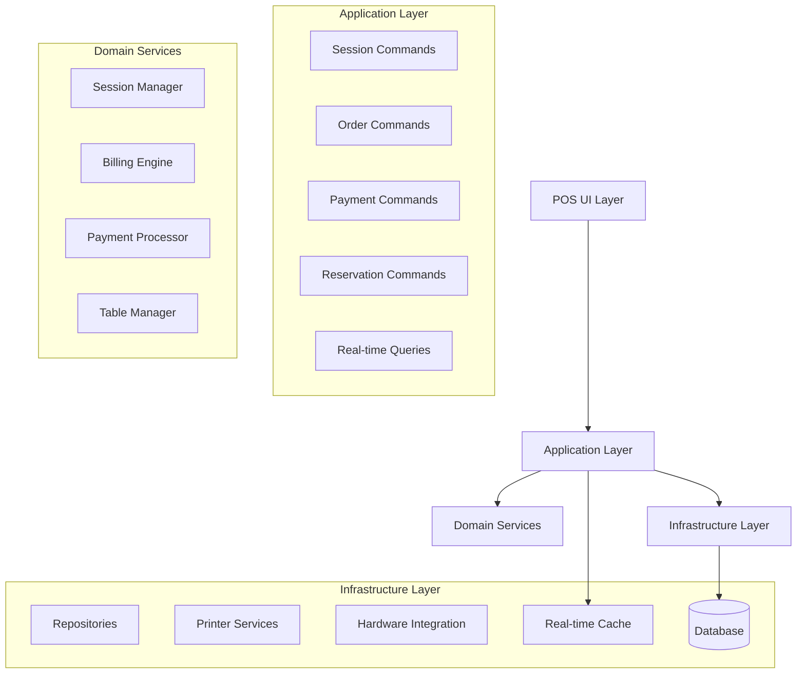
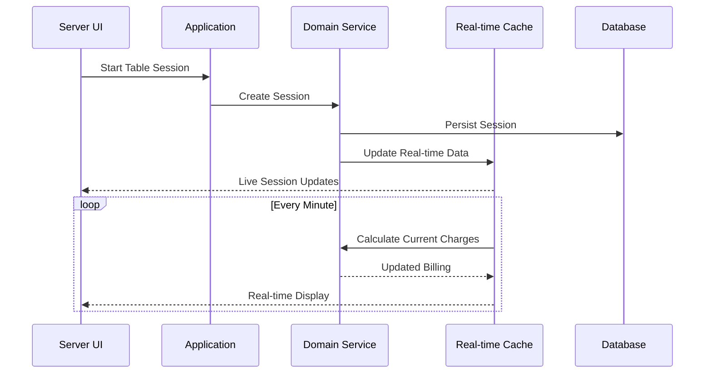

# Design Document: Core POS Operations

## Overview

The Core POS Operations system provides the essential functionality needed for daily billiard club operations. The design focuses on reliability, performance, and usability for servers and managers who need to efficiently manage table sessions, process orders, handle payments, and maintain smooth operations during busy periods.

## Architecture

### High-Level Architecture



### Real-Time Data Flow



## Components and Interfaces

### Session Management

```csharp
// Session management commands
public record StartTableSessionCommand(
    int TableNumber,
    int GuestCount,
    Guid ServerId,
    string? CustomerName = null,
    Guid? ReservationId = null
) : ICommand<TableSessionDto>;

public record PauseTableSessionCommand(
    Guid SessionId,
    string Reason
) : ICommand;

public record ResumeTableSessionCommand(
    Guid SessionId
) : ICommand;

public record EndTableSessionCommand(
    Guid SessionId,
    bool ForceEnd = false
) : ICommand<SessionBillingDto>;

// Real-time session queries
public interface ISessionQueries
{
    Task<IEnumerable<ActiveSessionDto>> GetActiveSessionsAsync();
    Task<SessionBillingDto> GetCurrentBillingAsync(Guid sessionId);
    Task<TableStatusDto> GetTableStatusAsync(int tableNumber);
    Task<FloorStatusDto> GetFloorStatusAsync(int floorId);
}
```

### Order Management

```csharp
// Order entry commands
public record AddOrderItemCommand(
    Guid TicketId,
    Guid MenuItemId,
    int Quantity,
    IEnumerable<Guid>? ModifierIds = null,
    string? SpecialInstructions = null
) : ICommand<OrderLineDto>;

public record RemoveOrderItemCommand(
    Guid TicketId,
    Guid OrderLineId,
    string? Reason = null
) : ICommand;

public record UpdateOrderItemCommand(
    Guid OrderLineId,
    int NewQuantity,
    IEnumerable<Guid>? ModifierIds = null
) : ICommand<OrderLineDto>;

// Kitchen/Bar integration
public interface IKitchenOrderService
{
    Task SendToKitchenAsync(OrderLineDto orderLine);
    Task SendToBarAsync(OrderLineDto orderLine);
    Task UpdateOrderStatusAsync(Guid orderLineId, OrderStatus status);
    Task<IEnumerable<KitchenOrderDto>> GetPendingOrdersAsync();
}
```

### Payment Processing

```csharp
// Payment commands
public record ProcessPaymentCommand(
    Guid TicketId,
    PaymentMethod PaymentMethod,
    decimal Amount,
    string? AuthorizationCode = null,
    decimal? TipAmount = null
) : ICommand<PaymentResultDto>;

public record ProcessSplitPaymentCommand(
    Guid TicketId,
    IEnumerable<SplitPaymentDto> Payments
) : ICommand<PaymentResultDto>;

public record ProcessRefundCommand(
    Guid TicketId,
    decimal Amount,
    string Reason,
    Guid ManagerId,
    string ManagerPin
) : ICommand<RefundResultDto>;

// Payment processing service
public interface IPaymentProcessor
{
    Task<PaymentResult> ProcessCashPaymentAsync(decimal amount, decimal? tipAmount = null);
    Task<PaymentResult> ProcessCardPaymentAsync(decimal amount, PaymentMethod method, decimal? tipAmount = null);
    Task<PaymentResult> ProcessRefundAsync(decimal amount, PaymentMethod originalMethod);
    Task<decimal> CalculateChangeAsync(decimal amountDue, decimal amountTendered);
}
```

### Real-Time Billing Engine

```csharp
public interface IBillingEngine
{
    Task<BillingSnapshot> CalculateCurrentChargesAsync(Guid sessionId);
    Task<BillingSnapshot> CalculateTicketTotalAsync(Guid ticketId);
    Task<TaxBreakdown> CalculateTaxesAsync(decimal subtotal, IEnumerable<TaxRate> applicableRates);
    Task<decimal> ApplyDiscountsAsync(decimal amount, IEnumerable<DiscountRule> discounts);
}

public record BillingSnapshot(
    Guid SessionId,
    TimeSpan ElapsedTime,
    decimal TimeCharges,
    decimal ProductCharges,
    decimal Subtotal,
    decimal TaxAmount,
    decimal Total,
    DateTime CalculatedAt
);
```

## Data Models

### Core DTOs

```csharp
// Session management
public record ActiveSessionDto(
    Guid SessionId,
    int TableNumber,
    string TableType,
    TimeSpan ElapsedTime,
    decimal CurrentCharges,
    int GuestCount,
    string ServerName,
    SessionStatus Status,
    DateTime StartTime,
    DateTime? PausedAt
);

public record SessionBillingDto(
    Guid SessionId,
    TimeSpan TotalTime,
    decimal TimeCharges,
    decimal HourlyRate,
    IEnumerable<TimeSegmentDto> TimeSegments,
    bool IsPaused,
    DateTime LastUpdated
);

// Order management
public record OrderLineDto(
    Guid OrderLineId,
    Guid MenuItemId,
    string ItemName,
    int Quantity,
    decimal UnitPrice,
    decimal LineTotal,
    IEnumerable<ModifierDto> Modifiers,
    string? SpecialInstructions,
    OrderStatus Status,
    DateTime OrderedAt
);

// Payment processing
public record PaymentResultDto(
    bool IsSuccessful,
    string? ErrorMessage,
    decimal AmountProcessed,
    decimal? ChangeAmount,
    string? TransactionId,
    DateTime ProcessedAt
);

// Table status
public record TableStatusDto(
    int TableNumber,
    string TableType,
    TableStatus Status,
    Guid? ActiveSessionId,
    TimeSpan? SessionDuration,
    decimal? CurrentCharges,
    string? AssignedServer
);
```

### Real-Time Cache Models

```csharp
// Cached session data for real-time updates
public class SessionCache
{
    public Guid SessionId { get; set; }
    public DateTime StartTime { get; set; }
    public DateTime? PausedAt { get; set; }
    public TimeSpan PausedDuration { get; set; }
    public decimal HourlyRate { get; set; }
    public int TableNumber { get; set; }
    public DateTime LastUpdated { get; set; }
    
    public TimeSpan GetElapsedTime()
    {
        var now = DateTime.UtcNow;
        var elapsed = now - StartTime - PausedDuration;
        
        if (PausedAt.HasValue)
        {
            elapsed -= (now - PausedAt.Value);
        }
        
        return elapsed;
    }
    
    public decimal GetCurrentCharges()
    {
        var elapsed = GetElapsedTime();
        return (decimal)elapsed.TotalHours * HourlyRate;
    }
}
```

## Performance Optimization

### Real-Time Updates

```csharp
public interface IRealTimeUpdateService
{
    Task StartSessionMonitoringAsync(Guid sessionId);
    Task StopSessionMonitoringAsync(Guid sessionId);
    Task<IEnumerable<SessionUpdate>> GetSessionUpdatesAsync();
    event EventHandler<SessionUpdateEventArgs> SessionUpdated;
}

// Background service for real-time billing updates
public class SessionMonitoringService : BackgroundService
{
    private readonly ISessionCache _cache;
    private readonly IBillingEngine _billingEngine;
    private readonly ILogger<SessionMonitoringService> _logger;
    
    protected override async Task ExecuteAsync(CancellationToken stoppingToken)
    {
        while (!stoppingToken.IsCancellationRequested)
        {
            await UpdateActiveSessionsAsync();
            await Task.Delay(TimeSpan.FromMinutes(1), stoppingToken);
        }
    }
    
    private async Task UpdateActiveSessionsAsync()
    {
        var activeSessions = await _cache.GetActiveSessionsAsync();
        
        foreach (var session in activeSessions)
        {
            var billing = await _billingEngine.CalculateCurrentChargesAsync(session.SessionId);
            await _cache.UpdateSessionBillingAsync(session.SessionId, billing);
        }
    }
}
```

### Caching Strategy

```csharp
public interface ISessionCache
{
    Task<SessionCache?> GetSessionAsync(Guid sessionId);
    Task SetSessionAsync(SessionCache session);
    Task RemoveSessionAsync(Guid sessionId);
    Task<IEnumerable<SessionCache>> GetActiveSessionsAsync();
    Task UpdateSessionBillingAsync(Guid sessionId, BillingSnapshot billing);
}

// Redis-based implementation for multi-terminal support
public class RedisSessionCache : ISessionCache
{
    private readonly IDatabase _database;
    private readonly ILogger<RedisSessionCache> _logger;
    
    public async Task<SessionCache?> GetSessionAsync(Guid sessionId)
    {
        var key = $"session:{sessionId}";
        var data = await _database.StringGetAsync(key);
        
        return data.HasValue ? JsonSerializer.Deserialize<SessionCache>(data) : null;
    }
    
    public async Task SetSessionAsync(SessionCache session)
    {
        var key = $"session:{session.SessionId}";
        var data = JsonSerializer.Serialize(session);
        
        await _database.StringSetAsync(key, data, TimeSpan.FromHours(24));
    }
}
```

## Error Handling and Recovery

### Offline Operation Support

```csharp
public interface IOfflineOperationService
{
    Task<bool> IsOnlineAsync();
    Task QueueOperationAsync(ICommand command);
    Task<IEnumerable<ICommand>> GetQueuedOperationsAsync();
    Task SyncQueuedOperationsAsync();
    event EventHandler<ConnectivityChangedEventArgs> ConnectivityChanged;
}

public class OfflineOperationService : IOfflineOperationService
{
    private readonly ILocalStorage _localStorage;
    private readonly ICommandDispatcher _commandDispatcher;
    private readonly Queue<ICommand> _operationQueue = new();
    
    public async Task QueueOperationAsync(ICommand command)
    {
        _operationQueue.Enqueue(command);
        await _localStorage.SaveQueueAsync(_operationQueue);
    }
    
    public async Task SyncQueuedOperationsAsync()
    {
        while (_operationQueue.Count > 0)
        {
            var command = _operationQueue.Dequeue();
            try
            {
                await _commandDispatcher.DispatchAsync(command);
            }
            catch (Exception ex)
            {
                // Re-queue failed operations
                _operationQueue.Enqueue(command);
                throw;
            }
        }
    }
}
```

### System Recovery

```csharp
public interface ISystemRecoveryService
{
    Task<RecoveryStatus> CheckSystemStatusAsync();
    Task<IEnumerable<ActiveSession>> RecoverActiveSessionsAsync();
    Task<IEnumerable<PendingTransaction>> RecoverPendingTransactionsAsync();
    Task RepairDataInconsistenciesAsync();
}

public class SystemRecoveryService : ISystemRecoveryService
{
    public async Task<IEnumerable<ActiveSession>> RecoverActiveSessionsAsync()
    {
        // Recover sessions that were active during system crash
        var activeSessions = await _repository.GetSessionsWithStatusAsync(SessionStatus.Active);
        
        foreach (var session in activeSessions)
        {
            // Validate session data and repair if necessary
            await ValidateAndRepairSessionAsync(session);
            
            // Restart real-time monitoring
            await _realTimeService.StartSessionMonitoringAsync(session.Id);
        }
        
        return activeSessions;
    }
}
```

## Testing Strategy

### Unit Testing Approach

```csharp
// Test session billing calculations
[Test]
public void CalculateCurrentCharges_WithActiveSession_ReturnsCorrectAmount()
{
    // Arrange
    var session = new SessionCache
    {
        SessionId = Guid.NewGuid(),
        StartTime = DateTime.UtcNow.AddHours(-2),
        HourlyRate = 25.00m,
        PausedDuration = TimeSpan.Zero
    };
    
    // Act
    var charges = session.GetCurrentCharges();
    
    // Assert
    Assert.That(charges, Is.EqualTo(50.00m).Within(0.01m));
}

// Test payment processing
[Test]
public async Task ProcessPayment_WithValidCashPayment_ReturnsSuccess()
{
    // Arrange
    var command = new ProcessPaymentCommand(
        TicketId: Guid.NewGuid(),
        PaymentMethod: PaymentMethod.Cash,
        Amount: 75.50m
    );
    
    // Act
    var result = await _handler.HandleAsync(command);
    
    // Assert
    Assert.That(result.IsSuccessful, Is.True);
    Assert.That(result.AmountProcessed, Is.EqualTo(75.50m));
}
```

### Integration Testing

```csharp
// Test complete session workflow
[Test]
public async Task CompleteSessionWorkflow_FromStartToPayment_Success()
{
    // Start session
    var startCommand = new StartTableSessionCommand(1, 4, _serverId);
    var session = await _sessionHandler.HandleAsync(startCommand);
    
    // Add orders
    var orderCommand = new AddOrderItemCommand(session.TicketId, _menuItemId, 2);
    await _orderHandler.HandleAsync(orderCommand);
    
    // Process payment
    var paymentCommand = new ProcessPaymentCommand(session.TicketId, PaymentMethod.Cash, 85.00m);
    var payment = await _paymentHandler.HandleAsync(paymentCommand);
    
    // Verify
    Assert.That(payment.IsSuccessful, Is.True);
    Assert.That(session.Status, Is.EqualTo(SessionStatus.Completed));
}
```

## Correctness Properties

*A property is a characteristic or behavior that should hold true across all valid executions of a system-essentially, a formal statement about what the system should do. Properties serve as the bridge between human-readable specifications and machine-verifiable correctness guarantees.*

### Core Properties

**Property 1: Session Time Accuracy**
*For any* active table session, the elapsed time calculation should equal the difference between current time and start time, minus any paused duration, and should never be negative
**Validates: Requirements 1.2, 2.1, 2.2**

**Property 2: Billing Calculation Integrity**
*For any* session billing calculation, the total charges should equal time charges plus product charges, and all monetary amounts should be non-negative and properly rounded
**Validates: Requirements 2.1, 2.3, 12.2**

**Property 3: Payment Balance Consistency**
*For any* completed payment transaction, the sum of all payments should equal the ticket total, and change calculations should be accurate to the cent
**Validates: Requirements 4.3, 4.4, 12.3**

**Property 4: Table Availability Consistency**
*For any* table at any given time, it should have exactly one status (available, occupied, or needs cleaning), and occupied tables should have exactly one active session
**Validates: Requirements 1.5, 5.1, 5.2**

**Property 5: Order Integrity**
*For any* order line added to a ticket, the line total should equal unit price times quantity plus modifier costs, and inventory should be decremented appropriately
**Validates: Requirements 3.3, 3.4, 12.1**

**Property 6: Manager Authorization Completeness**
*For any* operation requiring manager authorization, the system should verify manager credentials and log all override actions with complete audit trails
**Validates: Requirements 6.1, 6.2, 6.3**

**Property 7: Real-Time Update Consistency**
*For any* active session, real-time billing updates should reflect the current state within 60 seconds, and all connected terminals should show consistent data
**Validates: Requirements 2.1, 11.4, 12.4**

**Property 8: Cash Drawer Balance Accuracy**
*For any* cash drawer operation, the calculated balance should equal opening balance plus cash receipts minus cash disbursements, and all transactions should be logged
**Validates: Requirements 8.2, 8.3, 8.4**

**Property 9: System Recovery Completeness**
*For any* system restart or crash recovery, all active sessions should be restored with accurate timing and billing, and no transaction data should be lost
**Validates: Requirements 10.2, 10.4, 12.5**

**Property 10: Performance Response Time**
*For any* user interface operation under normal load, the system should respond within the specified time limits and maintain responsiveness across concurrent users
**Validates: Requirements 11.1, 11.2, 11.3, 11.4**

## UI Design Principles

### Responsiveness Requirements
- All navigation operations: < 200ms
- Billing calculations: < 100ms
- Payment processing: < 3 seconds
- Real-time updates: Every 60 seconds maximum

### Usability Guidelines
- Large touch targets (minimum 44px)
- High contrast colors for readability
- Clear visual feedback for all actions
- Consistent navigation patterns
- Error messages with clear resolution steps

### Accessibility Features
- Keyboard navigation support
- Screen reader compatibility
- Adjustable font sizes
- Color-blind friendly design
- Audio feedback for critical operations