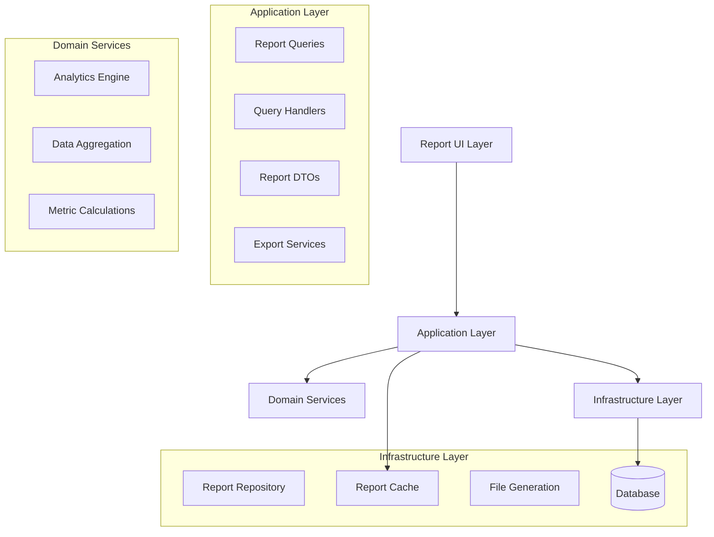
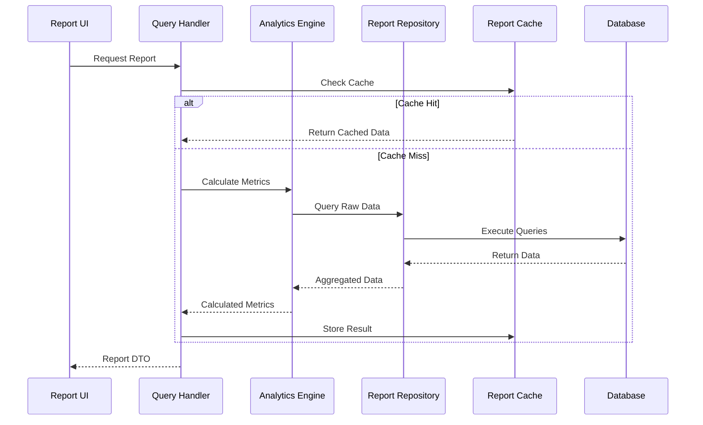

# Design Document: Reporting & Export

## Overview

The Reporting & Export system provides comprehensive business intelligence capabilities for billiard club operations. The system leverages existing transactional data to generate actionable insights through reports, analytics, and export functionality. The design follows Clean Architecture principles with a focus on performance, extensibility, and data accuracy.

## Architecture

### High-Level Architecture



### Data Flow Architecture



## Components and Interfaces

### Core Query Interfaces

```csharp
// Base report query interface
public interface IReportQuery<TResult>
{
    DateTime StartDate { get; }
    DateTime EndDate { get; }
    string? FilterCriteria { get; }
}

// Report query handler interface
public interface IReportQueryHandler<TQuery, TResult> 
    where TQuery : IReportQuery<TResult>
{
    Task<TResult> HandleAsync(TQuery query, CancellationToken cancellationToken = default);
}

// Export service interface
public interface IReportExportService
{
    Task<byte[]> ExportToPdfAsync<T>(T reportData, string templateName);
    Task<byte[]> ExportToExcelAsync<T>(T reportData, string templateName);
    Task<ExportResult> BatchExportAsync(IEnumerable<ExportRequest> requests);
}
```

### Analytics Engine

```csharp
public interface IAnalyticsEngine
{
    Task<TableUtilizationMetrics> CalculateTableUtilizationAsync(
        DateTime startDate, DateTime endDate);
    
    Task<RevenueMetrics> CalculateRevenueMetricsAsync(
        DateTime startDate, DateTime endDate);
    
    Task<MemberActivityMetrics> CalculateMemberActivityAsync(
        DateTime startDate, DateTime endDate);
    
    Task<TrendAnalysis> AnalyzeTrendsAsync(
        string metricType, DateTime startDate, DateTime endDate);
}

public class AnalyticsEngine : IAnalyticsEngine
{
    private readonly IReportRepository _repository;
    private readonly ITableSessionRepository _sessionRepository;
    private readonly ITicketRepository _ticketRepository;
    private readonly IMemberRepository _memberRepository;
    
    // Implementation focuses on efficient data aggregation
    // Uses database-level calculations where possible
    // Implements caching for expensive calculations
}
```

### Report Repository

```csharp
public interface IReportRepository
{
    // Daily Sales Data
    Task<DailySalesData> GetDailySalesDataAsync(DateTime date);
    Task<IEnumerable<HourlySalesData>> GetHourlySalesDataAsync(DateTime date);
    
    // Table Utilization Data
    Task<IEnumerable<TableSessionData>> GetTableSessionDataAsync(
        DateTime startDate, DateTime endDate);
    Task<IEnumerable<TableOccupancyData>> GetTableOccupancyDataAsync(
        DateTime startDate, DateTime endDate);
    
    // Revenue Data
    Task<IEnumerable<TimeRevenueData>> GetTimeRevenueDataAsync(
        DateTime startDate, DateTime endDate);
    Task<IEnumerable<ProductRevenueData>> GetProductRevenueDataAsync(
        DateTime startDate, DateTime endDate);
    
    // Member Data
    Task<IEnumerable<MemberActivityData>> GetMemberActivityDataAsync(
        DateTime startDate, DateTime endDate);
    Task<IEnumerable<MemberVisitData>> GetMemberVisitDataAsync(
        DateTime startDate, DateTime endDate);
}
```

## Data Models

### Report DTOs

```csharp
// Daily Sales Report
public record DailySalesReportDto(
    DateTime Date,
    Money TotalSales,
    Money TimeBasedSales,
    Money ProductSales,
    Money TotalTax,
    Money TotalGratuity,
    int TransactionCount,
    int CustomerCount,
    decimal AverageTicketSize,
    IEnumerable<HourlySalesDto> HourlyBreakdown,
    IEnumerable<CategorySalesDto> CategoryBreakdown,
    IEnumerable<PaymentMethodSalesDto> PaymentBreakdown,
    IEnumerable<TableSalesDto> TableBreakdown
);

// Table Utilization Report
public record TableUtilizationReportDto(
    DateTime StartDate,
    DateTime EndDate,
    decimal OverallOccupancyPercent,
    TimeSpan AverageSessionDuration,
    Money TotalTimeRevenue,
    IEnumerable<TableUtilizationDto> TableBreakdown,
    IEnumerable<HourlyOccupancyDto> HourlyOccupancy,
    IEnumerable<DayOfWeekOccupancyDto> WeeklyPattern
);

// Time Revenue Report
public record TimeRevenueReportDto(
    DateTime StartDate,
    DateTime EndDate,
    Money TotalTimeRevenue,
    TimeSpan TotalBilledTime,
    decimal AverageHourlyRate,
    decimal RevenuePerHour,
    IEnumerable<TableTypeRevenueDto> ByTableType,
    IEnumerable<DayOfWeekRevenueDto> ByDayOfWeek,
    IEnumerable<HourlyRevenueDto> ByHourOfDay
);

// Member Activity Report
public record MemberActivityReportDto(
    DateTime StartDate,
    DateTime EndDate,
    int TotalActiveMembers,
    int NewMembers,
    int ChurnedMembers,
    decimal ChurnRate,
    Money TotalMemberRevenue,
    decimal MemberRevenuePercent,
    decimal AverageMemberValue,
    IEnumerable<TopMemberDto> TopMembers,
    IEnumerable<AtRiskMemberDto> AtRiskMembers,
    IEnumerable<MemberTierDto> TierBreakdown
);
```

### Analytics Data Models

```csharp
// Core metrics for calculations
public record TableUtilizationMetrics(
    decimal OccupancyPercent,
    TimeSpan AverageSessionDuration,
    int TotalSessions,
    TimeSpan TotalOperatingHours,
    TimeSpan TotalOccupiedTime
);

public record RevenueMetrics(
    Money TotalRevenue,
    Money TimeRevenue,
    Money ProductRevenue,
    decimal TimeRevenuePercent,
    decimal GrowthRate,
    decimal AverageTransactionValue
);

public record MemberActivityMetrics(
    int ActiveMembers,
    int NewMembers,
    int ChurnedMembers,
    decimal RetentionRate,
    decimal AverageVisitFrequency,
    Money AverageMemberValue
);
```

## Performance Optimization

### Caching Strategy

```csharp
public interface IReportCacheService
{
    Task<T?> GetCachedReportAsync<T>(string cacheKey) where T : class;
    Task SetCachedReportAsync<T>(string cacheKey, T report, TimeSpan expiration);
    Task InvalidateCacheAsync(string pattern);
}

// Cache keys follow pattern: "report:{type}:{date}:{hash}"
// Daily reports cached for 24 hours
// Historical reports cached for 7 days
// Real-time dashboards cached for 5 minutes
```

### Database Optimization

```sql
-- Optimized queries use materialized views for complex aggregations
CREATE MATERIALIZED VIEW daily_sales_summary AS
SELECT 
    DATE(created_at) as sale_date,
    SUM(total_amount) as total_sales,
    SUM(CASE WHEN order_type = 'TIME_CHARGE' THEN total_amount ELSE 0 END) as time_sales,
    COUNT(*) as transaction_count,
    COUNT(DISTINCT customer_id) as customer_count
FROM tickets 
WHERE status = 'PAID'
GROUP BY DATE(created_at);

-- Indexes for performance
CREATE INDEX idx_tickets_date_status ON tickets(created_at, status);
CREATE INDEX idx_table_sessions_date_range ON table_sessions(start_time, end_time);
CREATE INDEX idx_members_last_visit ON members(last_visit_date);
```

## Error Handling

### Report Generation Errors

```csharp
public class ReportGenerationException : Exception
{
    public string ReportType { get; }
    public DateTime RequestedDate { get; }
    public string ErrorCode { get; }
    
    public ReportGenerationException(string reportType, DateTime date, string errorCode, string message) 
        : base(message)
    {
        ReportType = reportType;
        RequestedDate = date;
        ErrorCode = errorCode;
    }
}

// Error handling in query handlers
public async Task<DailySalesReportDto> HandleAsync(GetDailySalesReportQuery query)
{
    try
    {
        var data = await _repository.GetDailySalesDataAsync(query.Date);
        return MapToDto(data);
    }
    catch (Exception ex)
    {
        _logger.LogError(ex, "Failed to generate daily sales report for {Date}", query.Date);
        throw new ReportGenerationException("DailySales", query.Date, "DATA_ERROR", 
            "Unable to retrieve sales data for the requested date");
    }
}
```

## Testing Strategy

### Unit Testing Approach

```csharp
// Test analytics calculations
[Test]
public void CalculateTableUtilization_WithValidData_ReturnsCorrectPercentage()
{
    // Arrange
    var sessions = CreateTestSessions();
    var operatingHours = TimeSpan.FromHours(12);
    
    // Act
    var utilization = _analyticsEngine.CalculateUtilization(sessions, operatingHours);
    
    // Assert
    Assert.That(utilization.OccupancyPercent, Is.EqualTo(75.0m).Within(0.1m));
}

// Test report generation
[Test]
public async Task GenerateDailySalesReport_WithValidDate_ReturnsCompleteReport()
{
    // Arrange
    var date = new DateTime(2024, 1, 15);
    _mockRepository.Setup(r => r.GetDailySalesDataAsync(date))
               .ReturnsAsync(CreateTestSalesData());
    
    // Act
    var report = await _handler.HandleAsync(new GetDailySalesReportQuery(date));
    
    // Assert
    Assert.That(report.TotalSales.Amount, Is.GreaterThan(0));
    Assert.That(report.HourlyBreakdown, Is.Not.Empty);
}
```

### Integration Testing

```csharp
// Test complete report workflow
[Test]
public async Task CompleteReportWorkflow_GenerateAndExport_Success()
{
    // Generate report
    var report = await _reportService.GenerateDailySalesReportAsync(DateTime.Today);
    
    // Export to PDF
    var pdfBytes = await _exportService.ExportToPdfAsync(report, "daily-sales");
    
    // Verify
    Assert.That(pdfBytes.Length, Is.GreaterThan(1000));
    Assert.That(IsPdfValid(pdfBytes), Is.True);
}
```

## Correctness Properties

*A property is a characteristic or behavior that should hold true across all valid executions of a system-essentially, a formal statement about what the system should do. Properties serve as the bridge between human-readable specifications and machine-verifiable correctness guarantees.*

### Property Reflection

After analyzing all acceptance criteria, several properties can be consolidated to avoid redundancy:
- Multiple revenue calculation properties can be combined into comprehensive revenue integrity properties
- Data aggregation properties across different dimensions can be unified
- Filtering and categorization properties share common validation patterns

### Core Properties

**Property 1: Revenue Calculation Integrity**
*For any* sales data set, the sum of time-based charges, product sales, tax, and gratuity should equal the total sales amount, and all revenue components should be non-negative
**Validates: Requirements 1.1, 1.2, 3.1, 3.4**

**Property 2: Data Aggregation Consistency**
*For any* report with breakdown data, the sum of all breakdown categories should equal the total amount, and no category should be missing or duplicated
**Validates: Requirements 1.3, 1.4, 2.1, 3.2, 5.3**

**Property 3: Table Utilization Calculation Accuracy**
*For any* set of table sessions, the occupancy percentage should be calculated as (total occupied time / total operating time) * 100, and should never exceed 100% or be negative
**Validates: Requirements 2.1, 2.2, 2.4**

**Property 4: Date Range Filtering Completeness**
*For any* valid date range filter, all data within the range should be included, no data outside the range should be included, and boundary dates should be handled correctly
**Validates: Requirements 2.5, 3.3, 4.5, 11.1**

**Property 5: Member Activity Metrics Accuracy**
*For any* member activity calculation, visit frequency should equal total visits divided by time period, revenue attribution should sum correctly, and at-risk identification should be based on accurate last visit dates
**Validates: Requirements 4.1, 4.2, 4.3, 4.4**

**Property 6: Shift Summary Completeness**
*For any* shift period, the shift summary should include all transactions within the time range, cash reconciliation should balance, and all exception types should be captured
**Validates: Requirements 5.1, 5.2, 5.4, 5.5**

**Property 7: Export Format Integrity**
*For any* report export, the exported data should contain all source data fields, maintain data type integrity, and be readable by the target application format
**Validates: Requirements 6.1, 6.3, 6.4**

**Property 8: Server Performance Attribution**
*For any* server performance calculation, sales should be attributed only to the assigned server, tip calculations should be accurate, and performance rankings should be consistent
**Validates: Requirements 7.1, 7.2, 7.4, 7.5**

**Property 9: Inventory Calculation Accuracy**
*For any* inventory report, stock levels should reflect actual quantities, value calculations should use correct prices, and threshold-based alerts should trigger appropriately
**Validates: Requirements 8.1, 8.2, 8.3, 8.4**

**Property 10: Tax Calculation Compliance**
*For any* tax calculation, the correct rate should be applied based on jurisdiction and product type, taxable and non-taxable amounts should be separated correctly, and audit trails should be complete
**Validates: Requirements 9.1, 9.2, 9.3, 9.4**

**Property 11: Real-Time Data Accuracy**
*For any* dashboard display, current session data should reflect actual system state, occupancy calculations should be accurate, and alerts should trigger based on correct thresholds
**Validates: Requirements 10.2, 10.3, 10.4**

**Property 12: Trend Analysis Consistency**
*For any* trend analysis, period comparisons should use consistent calculation methods, growth rates should be mathematically correct, and seasonal patterns should be based on sufficient data
**Validates: Requirements 11.1, 11.2, 11.3, 11.5**

**Property 13: Custom Report Validation**
*For any* custom report configuration, filtering should work across all supported dimensions, data aggregation should produce consistent results, and invalid configurations should be rejected with clear error messages
**Validates: Requirements 12.2, 12.3, 12.4, 12.5**

### Edge Case Properties

**Property 14: Zero Data Handling**
*For any* report request with no underlying data, the system should return a valid empty report structure rather than failing, and all calculated fields should handle division by zero gracefully

**Property 15: Large Dataset Performance**
*For any* report covering extended time periods, the system should handle large datasets without memory overflow, and calculations should remain accurate regardless of data volume

**Property 16: Concurrent Report Generation**
*For any* simultaneous report requests, each report should be generated independently without data corruption, and caching should not cause incorrect results across different users