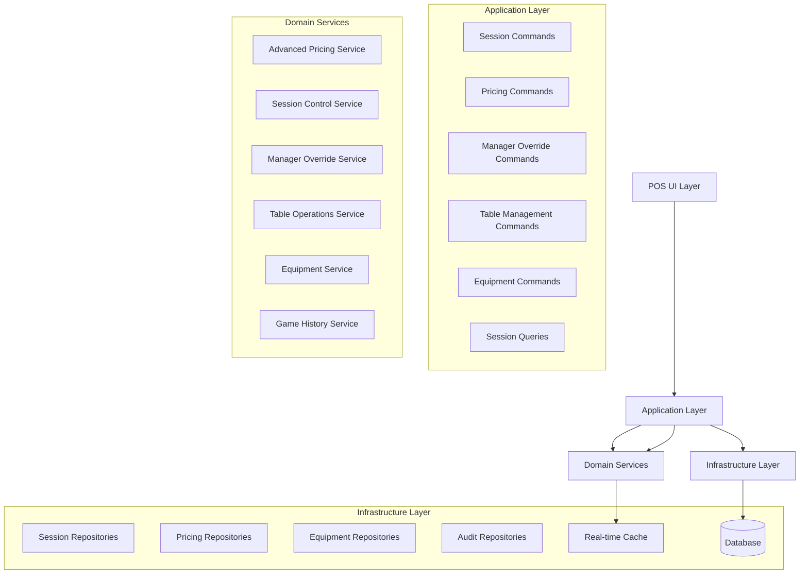
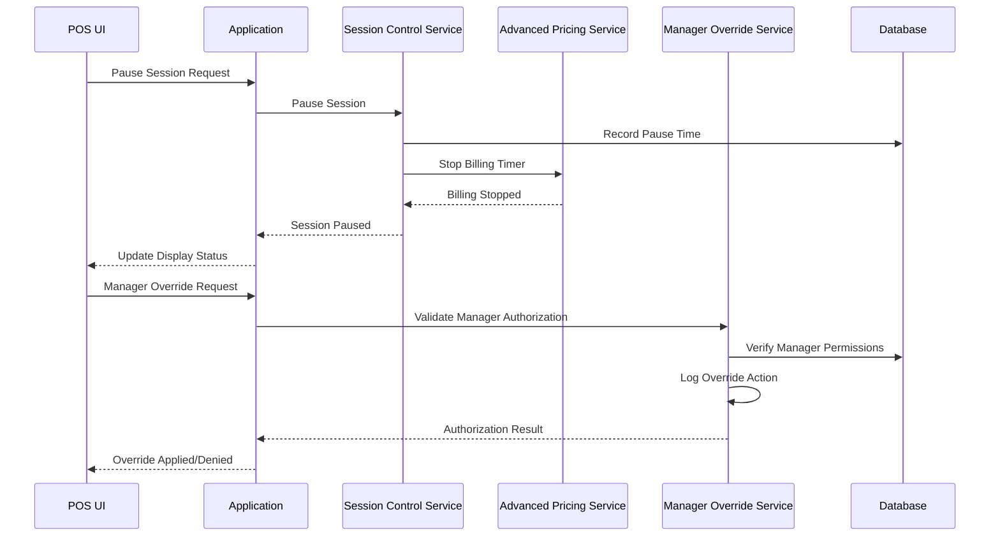

# Design Document: Table & Game Management

## Overview

The Table & Game Management system extends the existing table session functionality to provide comprehensive billiard club operations management. Building upon the current `TableSession` and `TableType` entities, this system adds advanced pricing rules, session control features, manager overrides, equipment management, and sophisticated table operations.

The design follows the established Clean Architecture pattern, extending the Domain layer with enhanced entities and services while maintaining strict separation of concerns. All operations remain immutable and auditable, consistent with the existing audit-first approach.

## Architecture

### High-Level Architecture


### Session Control Flow



## Components and Interfaces

### Enhanced Domain Services

#### Advanced Pricing Service
```csharp
public interface IAdvancedPricingService : IPricingService
{
    Task<Money> CalculateFirstHourPricingAsync(TimeSpan duration, TableType tableType);
    Task<TimeSpan> ApplyTimeRoundingAsync(TimeSpan duration, RoundingRule rule);
    Task<Money> ApplyMinimumChargeAsync(Money calculatedCharge, TableType tableType);
    Task<PricingSimulationResult> SimulatePricingAsync(PricingScenario scenario);
    Task<bool> ValidatePricingRulesAsync(TableType tableType);
}

public class AdvancedPricingService : IAdvancedPricingService
{
    public async Task<Money> CalculateFirstHourPricingAsync(TimeSpan duration, TableType tableType)
    {
        if (!tableType.FirstHourRate.HasValue)
        {
            return await CalculateTimeChargeAsync(duration, tableType);
        }
        
        var firstHourTime = TimeSpan.FromHours(1);
        Money totalCharge = Money.Zero();
        
        if (duration <= firstHourTime)
        {
            // Prorate first hour rate
            var fraction = (decimal)duration.TotalHours;
            totalCharge = new Money(tableType.FirstHourRate.Value * fraction);
        }
        else
        {
            // Full first hour + remaining time at standard rate
            totalCharge = new Money(tableType.FirstHourRate.Value);
            var remainingTime = duration - firstHourTime;
            var remainingCharge = await CalculateTimeChargeAsync(remainingTime, tableType);
            totalCharge += remainingCharge;
        }
        
        return await ApplyMinimumChargeAsync(totalCharge, tableType);
    }
}
```
#### Session Control Service
```csharp
public interface ISessionControlService
{
    Task<SessionControlResult> PauseSessionAsync(Guid sessionId, string reason);
    Task<SessionControlResult> ResumeSessionAsync(Guid sessionId);
    Task<SessionControlResult> UpdateGuestCountAsync(Guid sessionId, int newGuestCount, Guid staffId);
    Task<SessionControlResult> TransferSessionAsync(Guid sessionId, Guid targetTableId, string reason);
    Task<IEnumerable<SessionAlert>> GetSessionAlertsAsync();
}

public class SessionControlService : ISessionControlService
{
    private readonly ITableSessionRepository _sessionRepository;
    private readonly ISessionAuditService _auditService;
    
    public async Task<SessionControlResult> PauseSessionAsync(Guid sessionId, string reason)
    {
        var session = await _sessionRepository.GetByIdAsync(sessionId);
        if (session == null)
        {
            return SessionControlResult.NotFound();
        }
        
        if (session.Status != TableSessionStatus.Active)
        {
            return SessionControlResult.InvalidState("Session must be active to pause");
        }
        
        session.Pause();
        await _sessionRepository.UpdateAsync(session);
        
        await _auditService.LogSessionActionAsync(sessionId, "Paused", reason);
        
        return SessionControlResult.Success();
    }
}
```

#### Manager Override Service
```csharp
public interface IManagerOverrideService
{
    Task<OverrideResult> ValidateManagerAuthorizationAsync(string managerPin, Guid userId);
    Task<OverrideResult> ApplyTimeAdjustmentAsync(Guid sessionId, TimeSpan adjustment, string reason, Guid managerId);
    Task<OverrideResult> ApplyPricingOverrideAsync(Guid sessionId, Money overrideAmount, string reason, Guid managerId);
    Task<OverrideResult> ForceEndSessionAsync(Guid sessionId, string reason, Guid managerId);
    Task<IEnumerable<OverrideAuditEntry>> GetOverrideAuditTrailAsync(DateTime fromDate, DateTime toDate);
}

public class ManagerOverrideService : IManagerOverrideService
{
    public async Task<OverrideResult> ApplyTimeAdjustmentAsync(
        Guid sessionId, 
        TimeSpan adjustment, 
        string reason, 
        Guid managerId)
    {
        var session = await _sessionRepository.GetByIdAsync(sessionId);
        if (session == null)
        {
            return OverrideResult.NotFound();
        }
        
        session.AdjustTime(adjustment);
        await _sessionRepository.UpdateAsync(session);
        
        var auditEntry = new OverrideAuditEntry(
            SessionId: sessionId,
            OverrideType: OverrideType.TimeAdjustment,
            OriginalValue: session.GetBillableTime().ToString(),
            NewValue: (session.GetBillableTime() + adjustment).ToString(),
            Reason: reason,
            ManagerId: managerId,
            Timestamp: DateTime.UtcNow
        );
        
        await _auditService.LogOverrideAsync(auditEntry);
        
        return OverrideResult.Success();
    }
}
```
### New Domain Entities

#### Equipment Entity
```csharp
public class Equipment
{
    public Guid Id { get; private set; }
    public string Name { get; private set; }
    public string Description { get; private set; }
    public EquipmentType Type { get; private set; }
    public EquipmentStatus Status { get; private set; }
    public Guid? AssignedTableId { get; private set; }
    public DateTime? LastMaintenanceDate { get; private set; }
    public DateTime? NextMaintenanceDate { get; private set; }
    public bool IsActive { get; private set; }
    
    public static Equipment Create(string name, EquipmentType type, string description = "")
    {
        return new Equipment
        {
            Id = Guid.NewGuid(),
            Name = name,
            Type = type,
            Description = description,
            Status = EquipmentStatus.Available,
            IsActive = true
        };
    }
    
    public void AssignToTable(Guid tableId)
    {
        if (Status != EquipmentStatus.Available)
        {
            throw new BusinessRuleViolationException("Equipment must be available to assign to table");
        }
        
        AssignedTableId = tableId;
        Status = EquipmentStatus.InUse;
    }
    
    public void ScheduleMaintenance(DateTime maintenanceDate)
    {
        NextMaintenanceDate = maintenanceDate;
        if (maintenanceDate <= DateTime.UtcNow.AddDays(7))
        {
            Status = EquipmentStatus.MaintenanceRequired;
        }
    }
}

public enum EquipmentType
{
    Cue,
    BallSet,
    Rack,
    Chalk,
    BridgeStick,
    TableCover,
    Lighting,
    Other
}

public enum EquipmentStatus
{
    Available,
    InUse,
    MaintenanceRequired,
    OutOfService,
    Missing
}
```

#### Game History Entity
```csharp
public class GameHistory
{
    public Guid Id { get; private set; }
    public Guid SessionId { get; private set; }
    public Guid TableId { get; private set; }
    public GameType GameType { get; private set; }
    public DateTime StartTime { get; private set; }
    public DateTime EndTime { get; private set; }
    public TimeSpan Duration { get; private set; }
    public int PlayerCount { get; private set; }
    public Money TotalCharge { get; private set; }
    public string? Winner { get; private set; }
    public Dictionary<string, object> GameData { get; private set; } = new();
    
    public static GameHistory Create(
        Guid sessionId,
        Guid tableId,
        GameType gameType,
        DateTime startTime,
        int playerCount)
    {
        return new GameHistory
        {
            Id = Guid.NewGuid(),
            SessionId = sessionId,
            TableId = tableId,
            GameType = gameType,
            StartTime = startTime,
            PlayerCount = playerCount
        };
    }
    
    public void EndGame(string? winner = null)
    {
        EndTime = DateTime.UtcNow;
        Duration = EndTime - StartTime;
        Winner = winner;
    }
}
```
#### Server Assignment Entity
```csharp
public class ServerAssignment
{
    public Guid Id { get; private set; }
    public Guid SessionId { get; private set; }
    public Guid ServerId { get; private set; }
    public DateTime AssignedAt { get; private set; }
    public DateTime? UnassignedAt { get; private set; }
    public bool IsPrimary { get; private set; }
    public decimal AllocationPercentage { get; private set; }
    
    public static ServerAssignment Create(Guid sessionId, Guid serverId, bool isPrimary = true, decimal allocationPercentage = 100m)
    {
        if (allocationPercentage <= 0 || allocationPercentage > 100)
        {
            throw new BusinessRuleViolationException("Allocation percentage must be between 0 and 100");
        }
        
        return new ServerAssignment
        {
            Id = Guid.NewGuid(),
            SessionId = sessionId,
            ServerId = serverId,
            AssignedAt = DateTime.UtcNow,
            IsPrimary = isPrimary,
            AllocationPercentage = allocationPercentage
        };
    }
    
    public void Unassign()
    {
        UnassignedAt = DateTime.UtcNow;
    }
}
```

### Enhanced Value Objects

#### Pricing Scenario
```csharp
public record PricingScenario(
    TimeSpan Duration,
    TableType TableType,
    int GuestCount,
    DateTime StartTime,
    bool HasMemberDiscount = false
);

public record PricingSimulationResult(
    Money BaseCharge,
    Money FirstHourCharge,
    Money RemainingHoursCharge,
    Money MinimumChargeApplied,
    Money FinalCharge,
    TimeSpan RoundedDuration,
    IReadOnlyList<string> AppliedRules
);
```

#### Session Control Result
```csharp
public record SessionControlResult(
    bool IsSuccessful,
    string? ErrorMessage = null,
    SessionControlData? Data = null
)
{
    public static SessionControlResult Success(SessionControlData? data = null) => 
        new(true, null, data);
    
    public static SessionControlResult NotFound() => 
        new(false, "Session not found");
    
    public static SessionControlResult InvalidState(string message) => 
        new(false, message);
}

public record SessionControlData(
    Guid SessionId,
    TableSessionStatus Status,
    DateTime? PausedAt,
    TimeSpan TotalPausedDuration,
    Money CurrentCharge
);
```

#### Override Result
```csharp
public record OverrideResult(
    bool IsSuccessful,
    string? ErrorMessage = null,
    OverrideData? Data = null
)
{
    public static OverrideResult Success(OverrideData? data = null) => 
        new(true, null, data);
    
    public static OverrideResult Unauthorized() => 
        new(false, "Manager authorization required");
    
    public static OverrideResult NotFound() => 
        new(false, "Session not found");
}
```
## Correctness Properties

*A property is a characteristic or behavior that should hold true across all valid executions of a system—essentially, a formal statement about what the system should do. Properties serve as the bridge between human-readable specifications and machine-verifiable correctness guarantees.*

### Advanced Pricing Properties

**Property 1: First-Hour Pricing Calculation Accuracy**
*For any* session with first-hour pricing configured, the charge should use the first-hour rate for the initial hour (or fraction thereof) and standard rates for subsequent time, with proper minimum charge enforcement
**Validates: Requirements 1.1, 1.3, 1.4**

**Property 2: Time Rounding Rule Consistency**
*For any* session duration and rounding rule (15, 30, or 60 minutes), the rounded time should always round up to the next increment and billing should be based on the rounded duration
**Validates: Requirements 1.2, 1.4**

**Property 3: Pricing Rule Temporal Application**
*For any* pricing rule change, existing active sessions should continue using their original pricing while new sessions use the updated rules, ensuring no retroactive billing changes
**Validates: Requirements 1.5, 5.5**

### Session Control Properties

**Property 4: Pause/Resume Time Accuracy**
*For any* session that is paused and resumed, the total billable time should equal elapsed time minus all paused durations, and paused time should never be included in charges
**Validates: Requirements 2.1, 2.2, 2.3**

**Property 5: Session State Transition Validity**
*For any* session state change, transitions must follow valid sequences (Active↔Paused, Active→Ended), and invalid transitions should be rejected with appropriate error messages
**Validates: Requirements 2.1, 2.2, 3.3**

**Property 6: Long Pause Alert Generation**
*For any* session paused for more than 2 hours, an alert should be generated for staff review, and alerts should remain active until the session is resumed or ended
**Validates: Requirements 2.5, 12.2**

### Manager Override Properties

**Property 7: Manager Authorization Enforcement**
*For any* manager override operation (time adjustment, pricing override, force end), valid manager credentials must be provided and all actions must be logged with complete audit information
**Validates: Requirements 3.1, 3.2, 3.4, 3.5**

**Property 8: Override Audit Trail Completeness**
*For any* manager override action, the audit trail must include timestamp, manager ID, original value, new value, reason, and session context, and records must be immutable
**Validates: Requirements 3.4, 3.5**

### Guest Count and Display Properties

**Property 9: Guest Count Validation and Updates**
*For any* session, guest count must be between 1 and 20, updates require staff authorization, and changes should trigger pricing recalculation when applicable
**Validates: Requirements 4.1, 4.2, 4.3**

**Property 10: Real-Time Display Consistency**
*For any* active session, the floor plan display should show current status (active/paused), guest count, elapsed time, and current charges, with updates propagated within 5 seconds
**Validates: Requirements 2.4, 4.4, 12.1, 12.4, 15.3**

### Table Management Properties

**Property 11: Table Type Configuration Integrity**
*For any* table type modification, changes should not affect active sessions using that type, and all configuration parameters should be validated for mathematical consistency
**Validates: Requirements 5.3, 5.5, 13.2**

**Property 12: Equipment Assignment Consistency**
*For any* equipment item, it can only be assigned to one table at a time, and equipment status must accurately reflect availability and maintenance requirements
**Validates: Requirements 7.1, 7.2, 7.3**

### Table Operations Properties

**Property 13: Session Transfer Data Preservation**
*For any* session transfer between tables, all timing, billing, customer information, and server assignments must be preserved exactly, with proper audit trail logging
**Validates: Requirements 11.1, 11.2, 11.4**

**Property 14: Table Merge/Split Billing Accuracy**
*For any* table merge or split operation, the combined billing should equal the sum of individual table charges, and split allocations should total the original merged amount
**Validates: Requirements 10.1, 10.2, 10.3**

### Integration and Performance Properties

**Property 15: System Integration Consistency**
*For any* session ending, appropriate line items should be created in the ticket system, payment integration should work seamlessly, and data consistency should be maintained across all systems
**Validates: Requirements 14.1, 14.2, 14.4**

**Property 16: Performance and Scalability Requirements**
*For any* system operation under normal load (up to 50 concurrent sessions), response times should remain under 200ms, and session updates should propagate to all terminals within 5 seconds
**Validates: Requirements 15.1, 15.2, 15.3**

**Property 17: System Recovery and Data Preservation**
*For any* system failure or restart, all active session data should be preserved and recovered accurately, with no loss of timing, billing, or state information
**Validates: Requirements 15.4**
## Error Handling and Recovery

### Domain Exception Handling
```csharp
public class SessionControlException : DomainException
{
    public Guid SessionId { get; }
    public SessionControlException(Guid sessionId, string message) : base(message)
    {
        SessionId = sessionId;
    }
}

public class ManagerAuthorizationException : DomainException
{
    public string RequiredPermission { get; }
    public ManagerAuthorizationException(string permission, string message) : base(message)
    {
        RequiredPermission = permission;
    }
}

public class PricingRuleException : DomainException
{
    public string RuleName { get; }
    public PricingRuleException(string ruleName, string message) : base(message)
    {
        RuleName = ruleName;
    }
}
```

### Graceful Degradation Strategies
- **Pricing Service Failures**: Fall back to basic hourly rates with manual override capability
- **Equipment Service Unavailable**: Continue session operations with equipment warnings
- **Audit Service Failures**: Queue audit entries for later processing while maintaining operations
- **Real-time Update Failures**: Use polling fallback with increased frequency

## Testing Strategy

### Dual Testing Approach
The testing strategy combines unit tests for specific scenarios and property-based tests for comprehensive coverage:

**Unit Tests Focus:**
- Specific pricing calculation examples with known results
- Edge cases (zero duration, maximum guest counts, equipment conflicts)
- Error conditions and exception handling
- Manager override scenarios and authorization flows

**Property-Based Tests Focus:**
- Universal properties that hold for all valid inputs
- Comprehensive input coverage through randomization
- Session state transition validation across all possible sequences
- Pricing calculation accuracy across all rule combinations
- System integration consistency verification

### Property-Based Testing Configuration
- **Framework**: FsCheck.NET for C# property-based testing
- **Iterations**: Minimum 100 iterations per property test
- **Test Tagging**: Format: **Feature: table-game-management, Property {number}: {property_text}**
- **Coverage Requirements**: Domain layer ≥90%, Application layer ≥80%

### Test Data Generators
```csharp
// Generator for valid session durations
public static Arbitrary<TimeSpan> SessionDurationGenerator() =>
    Arb.From(Gen.Choose(1, 480).Select(minutes => TimeSpan.FromMinutes(minutes))); // 1 minute to 8 hours

// Generator for guest counts
public static Arbitrary<int> GuestCountGenerator() =>
    Arb.From(Gen.Choose(1, 20));

// Generator for pricing scenarios
public static Arbitrary<PricingScenario> PricingScenarioGenerator() =>
    Arb.From(
        from duration in SessionDurationGenerator().Generator
        from tableType in TableTypeGenerator().Generator
        from guestCount in GuestCountGenerator().Generator
        from startTime in Arb.Generate<DateTime>()
        select new PricingScenario(duration, tableType, guestCount, startTime));
```

## Integration Points

### Existing System Extensions
- **TableSession Entity**: Enhanced with pause/resume capabilities and manager override support
- **TableType Entity**: Extended with advanced pricing rules and equipment associations
- **Ticket System**: Integration for automatic time charge line item creation
- **Payment System**: Enhanced for seamless checkout with complex pricing
- **Reporting System**: Extended with game history and advanced analytics

### New System Integrations
- **Equipment Management**: Real-time equipment tracking and maintenance scheduling
- **Staff Management**: Server assignment and performance tracking integration
- **Alert System**: Automated notifications for long pauses, maintenance needs, and capacity issues
- **Analytics Engine**: Advanced reporting for game history, utilization, and revenue optimization

## Performance Considerations

### Caching Strategy
- **Active Sessions**: Cache in Redis with 30-second TTL for real-time updates
- **Pricing Rules**: Cache with 1-hour TTL, invalidate on configuration changes
- **Equipment Status**: Cache with 5-minute TTL for availability checks
- **Manager Permissions**: Cache for session duration with immediate invalidation on role changes

### Optimization Techniques
- **Batch Processing**: Support for bulk session operations and reporting
- **Lazy Loading**: Load complex pricing rules and equipment details only when needed
- **Connection Pooling**: Efficient database connections for high-volume session operations
- **Async Processing**: Non-blocking operations for alerts, audit logging, and reporting