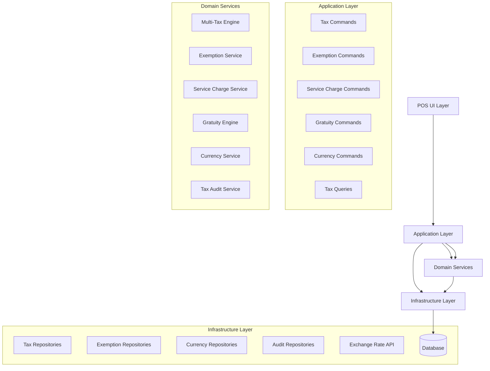
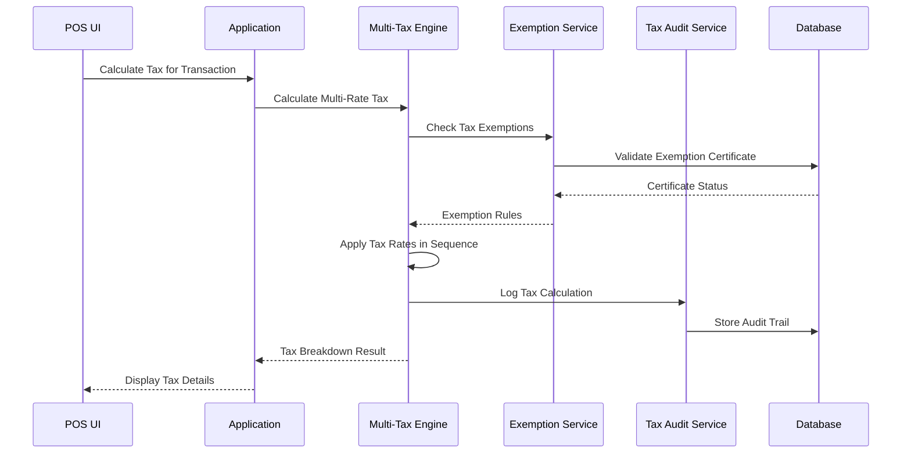

# Design Document: Tax, Currency & Financial Rules

## Overview

The Tax, Currency & Financial Rules system extends the existing Magidesk POS architecture to provide comprehensive financial calculation capabilities. Building upon the current `TaxDomainService`, `TaxRate`, and `TaxGroup` value objects, this system adds multi-tax rate support, tax exemption management, service charge automation, auto-gratuity rules, and multi-currency capabilities.

The design follows the established Clean Architecture pattern, extending the Domain layer with new entities and services while maintaining strict separation of concerns. All financial calculations remain immutable and auditable, consistent with the existing audit-first approach.

## Architecture

### High-Level Architecture



### Tax Calculation Flow



## Components and Interfaces

### Enhanced Tax Domain Services

#### Multi-Tax Engine
```csharp
public interface IMultiTaxEngine
{
    Task<TaxCalculationResult> CalculateMultiTaxAsync(
        Money baseAmount, 
        IEnumerable<TaxRate> applicableRates,
        TaxCalculationMode mode = TaxCalculationMode.Exclusive,
        TaxExemption? exemption = null);
    
    Task<TaxBreakdown> GetDetailedBreakdownAsync(
        Money baseAmount, 
        IEnumerable<TaxRate> applicableRates,
        TaxExemption? exemption = null);
    
    Task<Money> CalculateCompoundTaxAsync(
        Money baseAmount, 
        IEnumerable<TaxRate> compoundRates);
}

public class MultiTaxEngine : IMultiTaxEngine
{
    private readonly ITaxAuditService _auditService;
    private readonly IExemptionService _exemptionService;
    
    public async Task<TaxCalculationResult> CalculateMultiTaxAsync(
        Money baseAmount, 
        IEnumerable<TaxRate> applicableRates,
        TaxCalculationMode mode = TaxCalculationMode.Exclusive,
        TaxExemption? exemption = null)
    {
        var rates = applicableRates.ToList();
        ValidateRateCount(rates);
        
        var exemptRates = await _exemptionService.GetExemptRatesAsync(exemption, rates);
        var taxableRates = rates.Except(exemptRates).ToList();
        
        var breakdown = new Dictionary<string, Money>();
        Money totalTax = Money.Zero();
        Money currentBase = baseAmount;
        
        // Apply taxes in sequence, handling compound taxes
        foreach (var rate in taxableRates.OrderBy(r => r.CalculationOrder))
        {
            Money taxAmount = rate.IsCompound 
                ? rate.CalculateTax(currentBase)
                : rate.CalculateTax(baseAmount);
                
            breakdown[rate.Name] = taxAmount;
            totalTax += taxAmount;
            
            if (rate.IsCompound)
            {
                currentBase = baseAmount + totalTax;
            }
        }
        
        // Apply rounding rules
        totalTax = ApplyRoundingRules(totalTax, rates);
        
        // Log calculation for audit
        await _auditService.LogTaxCalculationAsync(baseAmount, rates, totalTax, exemption);
        
        return new TaxCalculationResult(
            BaseAmount: baseAmount,
            TotalTax: totalTax,
            FinalAmount: mode == TaxCalculationMode.Exclusive ? baseAmount + totalTax : baseAmount,
            Breakdown: breakdown,
            Mode: mode,
            AppliedExemption: exemption
        );
    }
    
    private void ValidateRateCount(IList<TaxRate> rates)
    {
        if (rates.Count > 5)
        {
            throw new BusinessRuleViolationException("Cannot apply more than 5 tax rates per transaction.");
        }
    }
}
```

#### Tax Exemption Service
```csharp
public interface IExemptionService
{
    Task<TaxExemption?> ValidateExemptionCertificateAsync(string certificateNumber, Guid customerId);
    Task<IEnumerable<TaxRate>> GetExemptRatesAsync(TaxExemption? exemption, IEnumerable<TaxRate> allRates);
    Task<ExemptionValidationResult> CheckExemptionValidityAsync(TaxExemption exemption, DateTime transactionDate);
    Task LogExemptionUsageAsync(TaxExemption exemption, Guid transactionId, Guid userId);
}

public class ExemptionService : IExemptionService
{
    private readonly ITaxExemptionRepository _exemptionRepository;
    private readonly ITaxAuditService _auditService;
    
    public async Task<TaxExemption?> ValidateExemptionCertificateAsync(string certificateNumber, Guid customerId)
    {
        var exemption = await _exemptionRepository.GetByCertificateNumberAsync(certificateNumber);
        
        if (exemption == null)
        {
            return null;
        }
        
        if (exemption.CustomerId != customerId)
        {
            throw new BusinessRuleViolationException("Exemption certificate does not belong to this customer.");
        }
        
        var validationResult = await CheckExemptionValidityAsync(exemption, DateTime.UtcNow);
        if (!validationResult.IsValid)
        {
            throw new BusinessRuleViolationException($"Exemption certificate is invalid: {validationResult.Reason}");
        }
        
        return exemption;
    }
    
    public async Task<ExemptionValidationResult> CheckExemptionValidityAsync(TaxExemption exemption, DateTime transactionDate)
    {
        if (exemption.ExpirationDate.HasValue && exemption.ExpirationDate.Value < transactionDate)
        {
            return ExemptionValidationResult.Invalid("Certificate has expired");
        }
        
        if (exemption.EffectiveDate > transactionDate)
        {
            return ExemptionValidationResult.Invalid("Certificate is not yet effective");
        }
        
        return ExemptionValidationResult.Valid();
    }
}
```

### Service Charge Management

#### Service Charge Engine
```csharp
public interface IServiceChargeEngine
{
    Task<ServiceChargeResult> CalculateServiceChargeAsync(
        ServiceChargeRule rule, 
        int partySize, 
        Money billAmount, 
        DateTime serviceTime);
    
    Task<IEnumerable<ServiceChargeRule>> GetApplicableRulesAsync(
        int partySize, 
        Money billAmount, 
        DateTime serviceTime);
    
    Task<ServiceChargeResult> ApplyManagerOverrideAsync(
        ServiceChargeResult originalCharge, 
        Money overrideAmount, 
        string reason, 
        Guid managerId);
}

public class ServiceChargeEngine : IServiceChargeEngine
{
    public async Task<ServiceChargeResult> CalculateServiceChargeAsync(
        ServiceChargeRule rule, 
        int partySize, 
        Money billAmount, 
        DateTime serviceTime)
    {
        if (!rule.IsApplicable(partySize, billAmount, serviceTime))
        {
            return ServiceChargeResult.NoCharge();
        }
        
        Money chargeAmount = rule.ChargeType switch
        {
            ServiceChargeType.Percentage => billAmount * rule.Rate,
            ServiceChargeType.FixedAmount => new Money(rule.FixedAmount, billAmount.Currency),
            _ => throw new ArgumentException($"Unknown service charge type: {rule.ChargeType}")
        };
        
        return new ServiceChargeResult(
            Rule: rule,
            Amount: chargeAmount,
            IsAutomatic: true,
            AppliedAt: DateTime.UtcNow
        );
    }
}
```

### Auto-Gratuity Engine

#### Gratuity Calculation Service
```csharp
public interface IGratuityEngine
{
    Task<GratuityResult> CalculateAutoGratuityAsync(
        GratuityRule rule,
        Money billAmount,
        int partySize,
        DateTime serviceTime,
        bool usePreTaxAmount = true);
    
    Task<GratuityAllocation> AllocateGratuityToServersAsync(
        Money gratuityAmount,
        IEnumerable<ServerAssignment> serverAssignments);
    
    Task<GratuityResult> ApplyCustomerAdjustmentAsync(
        GratuityResult originalGratuity,
        Money adjustedAmount,
        string reason,
        Guid? managerAuthorizationId = null);
}

public class GratuityEngine : IGratuityEngine
{
    public async Task<GratuityResult> CalculateAutoGratuityAsync(
        GratuityRule rule,
        Money billAmount,
        int partySize,
        DateTime serviceTime,
        bool usePreTaxAmount = true)
    {
        if (!rule.IsApplicable(partySize, billAmount, serviceTime))
        {
            return GratuityResult.NoGratuity();
        }
        
        Money calculationBase = usePreTaxAmount ? billAmount : billAmount; // Would include tax if post-tax
        Money gratuityAmount = calculationBase * rule.Percentage;
        
        return new GratuityResult(
            Rule: rule,
            Amount: gratuityAmount,
            CalculationBase: calculationBase,
            IsAutomatic: true,
            AppliedAt: DateTime.UtcNow
        );
    }
    
    public async Task<GratuityAllocation> AllocateGratuityToServersAsync(
        Money gratuityAmount,
        IEnumerable<ServerAssignment> serverAssignments)
    {
        var assignments = serverAssignments.ToList();
        var totalWeight = assignments.Sum(a => a.AllocationWeight);
        
        var allocations = new Dictionary<Guid, Money>();
        
        foreach (var assignment in assignments)
        {
            var serverPortion = gratuityAmount * (assignment.AllocationWeight / totalWeight);
            allocations[assignment.ServerId] = serverPortion;
        }
        
        return new GratuityAllocation(allocations);
    }
}
```

### Multi-Currency Support

#### Currency Service
```csharp
public interface ICurrencyService
{
    Task<IEnumerable<Currency>> GetSupportedCurrenciesAsync();
    Task<ExchangeRate> GetExchangeRateAsync(string fromCurrency, string toCurrency, DateTime? rateDate = null);
    Task<Money> ConvertCurrencyAsync(Money amount, string targetCurrency, DateTime? rateDate = null);
    Task<CurrencyDisplayInfo> GetDisplayInfoAsync(string currencyCode);
    Task<Money> FormatForDisplayAsync(Money amount, string displayCurrency, CultureInfo? culture = null);
}

public class CurrencyService : ICurrencyService
{
    private readonly ICurrencyRepository _currencyRepository;
    private readonly IExchangeRateProvider _exchangeRateProvider;
    private readonly Currency _baseCurrency;
    
    public async Task<Money> ConvertCurrencyAsync(Money amount, string targetCurrency, DateTime? rateDate = null)
    {
        if (amount.Currency == targetCurrency)
        {
            return amount;
        }
        
        var exchangeRate = await GetExchangeRateAsync(amount.Currency, targetCurrency, rateDate);
        var convertedAmount = amount.Amount * exchangeRate.Rate;
        
        return new Money(convertedAmount, targetCurrency);
    }
    
    public async Task<Money> FormatForDisplayAsync(Money amount, string displayCurrency, CultureInfo? culture = null)
    {
        var displayAmount = await ConvertCurrencyAsync(amount, displayCurrency);
        var displayInfo = await GetDisplayInfoAsync(displayCurrency);
        
        // Apply culture-specific formatting rules
        var formattedAmount = ApplyCultureFormatting(displayAmount, displayInfo, culture);
        
        return formattedAmount;
    }
}
```

## Data Models

### New Domain Entities

#### TaxExemption Entity
```csharp
public class TaxExemption
{
    public Guid Id { get; private set; }
    public Guid CustomerId { get; private set; }
    public string CertificateNumber { get; private set; }
    public string IssuingAuthority { get; private set; }
    public DateTime EffectiveDate { get; private set; }
    public DateTime? ExpirationDate { get; private set; }
    public ExemptionType Type { get; private set; }
    public IReadOnlyList<string> ExemptTaxTypes { get; private set; }
    public bool IsActive { get; private set; }
    
    public static TaxExemption Create(
        Guid customerId,
        string certificateNumber,
        string issuingAuthority,
        DateTime effectiveDate,
        ExemptionType type,
        IEnumerable<string> exemptTaxTypes,
        DateTime? expirationDate = null)
    {
        // Validation and creation logic
    }
    
    public bool IsValidForDate(DateTime date) =>
        date >= EffectiveDate && 
        (!ExpirationDate.HasValue || date <= ExpirationDate.Value) &&
        IsActive;
    
    public bool ExemptsFromTax(string taxType) =>
        ExemptTaxTypes.Contains(taxType, StringComparer.OrdinalIgnoreCase);
}
```

#### ServiceChargeRule Entity
```csharp
public class ServiceChargeRule
{
    public Guid Id { get; private set; }
    public string Name { get; private set; }
    public ServiceChargeType ChargeType { get; private set; }
    public decimal Rate { get; private set; } // For percentage-based
    public decimal FixedAmount { get; private set; } // For fixed amount
    public int MinimumPartySize { get; private set; }
    public Money? MinimumBillAmount { get; private set; }
    public TimeSpan? StartTime { get; private set; }
    public TimeSpan? EndTime { get; private set; }
    public bool IsTaxable { get; private set; }
    public bool IsActive { get; private set; }
    
    public bool IsApplicable(int partySize, Money billAmount, DateTime serviceTime)
    {
        if (!IsActive) return false;
        if (partySize < MinimumPartySize) return false;
        if (MinimumBillAmount.HasValue && billAmount < MinimumBillAmount.Value) return false;
        
        if (StartTime.HasValue && EndTime.HasValue)
        {
            var timeOfDay = serviceTime.TimeOfDay;
            return timeOfDay >= StartTime.Value && timeOfDay <= EndTime.Value;
        }
        
        return true;
    }
}
```

#### GratuityRule Entity
```csharp
public class GratuityRule
{
    public Guid Id { get; private set; }
    public string Name { get; private set; }
    public decimal Percentage { get; private set; }
    public int MinimumPartySize { get; private set; }
    public Money? MinimumBillAmount { get; private set; }
    public TimeSpan? StartTime { get; private set; }
    public TimeSpan? EndTime { get; private set; }
    public bool UsePreTaxAmount { get; private set; }
    public bool AllowCustomerAdjustment { get; private set; }
    public bool RequireManagerApprovalForRemoval { get; private set; }
    public bool IsActive { get; private set; }
    
    public bool IsApplicable(int partySize, Money billAmount, DateTime serviceTime)
    {
        // Similar logic to ServiceChargeRule
    }
}
```

#### Currency Entity
```csharp
public class Currency
{
    public string Code { get; private set; } // ISO 4217 code
    public string Name { get; private set; }
    public string Symbol { get; private set; }
    public int DecimalPlaces { get; private set; }
    public bool IsBaseCurrency { get; private set; }
    public bool IsActive { get; private set; }
    public CurrencyDisplayFormat DisplayFormat { get; private set; }
    
    public static Currency Create(string code, string name, string symbol, int decimalPlaces = 2)
    {
        // Validation and creation logic
    }
}
```

### Enhanced Value Objects

#### TaxCalculationResult
```csharp
public record TaxCalculationResult(
    Money BaseAmount,
    Money TotalTax,
    Money FinalAmount,
    IReadOnlyDictionary<string, Money> Breakdown,
    TaxCalculationMode Mode,
    TaxExemption? AppliedExemption
);
```

#### ServiceChargeResult
```csharp
public record ServiceChargeResult(
    ServiceChargeRule Rule,
    Money Amount,
    bool IsAutomatic,
    DateTime AppliedAt,
    Guid? ManagerOverrideId = null,
    string? OverrideReason = null
)
{
    public static ServiceChargeResult NoCharge() => 
        new(null!, Money.Zero(), false, DateTime.UtcNow);
}
```

#### GratuityResult
```csharp
public record GratuityResult(
    GratuityRule Rule,
    Money Amount,
    Money CalculationBase,
    bool IsAutomatic,
    DateTime AppliedAt,
    Money? CustomerAdjustment = null,
    Guid? ManagerAuthorizationId = null
)
{
    public static GratuityResult NoGratuity() => 
        new(null!, Money.Zero(), Money.Zero(), false, DateTime.UtcNow);
}
```

## Correctness Properties

*A property is a characteristic or behavior that should hold true across all valid executions of a system—essentially, a formal statement about what the system should do. Properties serve as the bridge between human-readable specifications and machine-verifiable correctness guarantees.*

### Core Tax Calculation Properties

**Property 1: Multi-Tax Rate Calculation Accuracy**
*For any* transaction with multiple tax rates (up to 5), the total tax should equal the sum of individual tax calculations applied in the correct sequence, and compound taxes should use the cumulative base amount
**Validates: Requirements 1.1, 1.2, 7.1**

**Property 2: Tax Exemption Application Consistency**
*For any* transaction with valid tax exemptions, only the specified tax types should be exempted, and the exemption should be applied consistently across all applicable line items
**Validates: Requirements 2.1, 2.2, 2.4**

**Property 3: Tax Calculation Mode Correctness**
*For any* transaction, tax-inclusive and tax-exclusive calculations should be mathematically inverse operations, where converting from inclusive to exclusive and back yields the original amount
**Validates: Requirements 1.4, 3.4**

**Property 4: Tax Breakdown Display Completeness**
*For any* transaction with multiple taxes, the displayed breakdown should include all individual tax components, their calculation bases, and the sequence should match the configured order
**Validates: Requirements 3.1, 3.2, 3.3**

### Service Charge and Gratuity Properties

**Property 5: Service Charge Rule Application**
*For any* transaction, service charges should be applied automatically when party size, bill amount, and time conditions are met, and should be calculated correctly based on the configured type (percentage or fixed)
**Validates: Requirements 4.1, 4.2, 4.5**

**Property 6: Auto-Gratuity Calculation Accuracy**
*For any* transaction meeting gratuity rules, the calculated gratuity should be based on the correct amount (pre-tax or post-tax as configured) and should be properly allocated among assigned servers
**Validates: Requirements 5.1, 5.2, 5.5**

**Property 7: Service Charge and Gratuity Distinction**
*For any* transaction with both service charges and gratuity, they should appear as separate line items with clear identification, and modifications should require appropriate authorization
**Validates: Requirements 4.3, 4.4, 5.3, 5.4**

### Currency and Localization Properties

**Property 8: Multi-Currency Conversion Consistency**
*For any* currency conversion operation, converting from currency A to B and then back to A should yield the original amount within acceptable rounding precision, and all conversions should use current exchange rates
**Validates: Requirements 6.2, 6.3, 9.3**

**Property 9: Currency Display Format Compliance**
*For any* monetary amount displayed in different currencies, the formatting should follow the correct currency-specific rules for symbols, decimal places, and number formatting conventions
**Validates: Requirements 9.1, 9.2, 9.4, 9.5**

**Property 10: Base Currency Accounting Integrity**
*For any* multi-currency transaction, the base currency amounts should be maintained for accounting purposes while display currencies are used for customer interaction, and all reports should reconcile to base currency
**Validates: Requirements 6.4, 6.5**

### Audit and Compliance Properties

**Property 11: Financial Rule Audit Trail Completeness**
*For any* financial rule application (tax, exemption, service charge, gratuity), all calculation steps, user actions, and authorization details should be logged immutably with complete traceability
**Validates: Requirements 2.3, 8.3, 10.1, 10.2, 10.3, 10.4**

**Property 12: Tax Reporting Accuracy**
*For any* reporting period, the sum of individual transaction taxes should equal the total tax collected, exempt transactions should be properly categorized, and all required compliance data should be available for export
**Validates: Requirements 8.1, 8.2, 8.4, 8.5**

**Property 13: Payment Integration Tax Consistency**
*For any* payment processing operation, tax amounts passed to payment processors should match calculated amounts, and reconciliation should show no discrepancies between internal and external tax records
**Validates: Requirements 11.1, 11.2, 11.3, 11.5**

### Performance and System Properties

**Property 14: Tax Calculation Performance**
*For any* complex tax calculation involving multiple rates, exemptions, and currency conversions, the processing should complete within 100 milliseconds and maintain performance under concurrent load
**Validates: Requirements 12.1, 12.3**

**Property 15: Configuration Hot-Update Capability**
*For any* tax rule, service charge, or gratuity configuration change, the system should apply updates immediately without downtime and ensure all subsequent calculations use the new rules
**Validates: Requirements 1.3, 7.4, 12.5**

## Error Handling and Recovery

### Domain Exception Handling
```csharp
public class TaxCalculationException : DomainException
{
    public TaxCalculationException(string message, Exception? innerException = null) 
        : base(message, innerException) { }
}

public class ExemptionValidationException : DomainException
{
    public string CertificateNumber { get; }
    public ExemptionValidationException(string certificateNumber, string message) 
        : base(message)
    {
        CertificateNumber = certificateNumber;
    }
}

public class CurrencyConversionException : DomainException
{
    public string FromCurrency { get; }
    public string ToCurrency { get; }
    
    public CurrencyConversionException(string fromCurrency, string toCurrency, string message) 
        : base(message)
    {
        FromCurrency = fromCurrency;
        ToCurrency = toCurrency;
    }
}
```

### Graceful Degradation
- **Exchange Rate Failures**: Fall back to cached rates with staleness warnings
- **Tax Service Unavailable**: Use default tax rates with manual override capability
- **Audit Service Failures**: Queue audit entries for later processing
- **Currency Service Failures**: Default to base currency with conversion notifications

## Testing Strategy

### Dual Testing Approach
The testing strategy combines unit tests for specific scenarios and property-based tests for comprehensive coverage:

**Unit Tests Focus:**
- Specific tax calculation examples with known results
- Edge cases (zero amounts, maximum rates, expired exemptions)
- Error conditions and exception handling
- Integration points between services

**Property-Based Tests Focus:**
- Universal properties that hold for all valid inputs
- Comprehensive input coverage through randomization
- Tax calculation accuracy across all rate combinations
- Currency conversion round-trip consistency
- Audit trail completeness verification

### Property-Based Testing Configuration
- **Framework**: FsCheck.NET for C# property-based testing
- **Iterations**: Minimum 100 iterations per property test
- **Test Tagging**: Format: **Feature: tax-financial-rules, Property {number}: {property_text}**
- **Coverage Requirements**: Domain layer ≥90%, Application layer ≥80%

### Test Data Generators
```csharp
// Generator for valid tax rates
public static Arbitrary<TaxRate> TaxRateGenerator() =>
    Arb.From(
        from rate in Gen.Choose(0.0m, 0.25m) // 0% to 25%
        from name in Gen.Elements("Federal", "State", "City", "County")
        from isCompound in Arb.Generate<bool>()
        select new TaxRate(rate, name, isCompound));

// Generator for valid money amounts
public static Arbitrary<Money> MoneyGenerator() =>
    Arb.From(
        from amount in Gen.Choose(0.01m, 10000.00m)
        from currency in Gen.Elements("USD", "EUR", "GBP", "CAD")
        select new Money(amount, currency));

// Generator for service charge scenarios
public static Arbitrary<ServiceChargeScenario> ServiceChargeScenarioGenerator() =>
    Arb.From(
        from partySize in Gen.Choose(1, 20)
        from billAmount in MoneyGenerator().Generator
        from serviceTime in Arb.Generate<DateTime>()
        select new ServiceChargeScenario(partySize, billAmount, serviceTime));
```

### Example Property Test
```csharp
[Property]
public Property MultiTaxCalculationAccuracy()
{
    return Prop.ForAll(
        MoneyGenerator(),
        Gen.ListOf(TaxRateGenerator()).Where(rates => rates.Count <= 5),
        (baseAmount, taxRates) =>
        {
            var engine = new MultiTaxEngine(_auditService, _exemptionService);
            var result = engine.CalculateMultiTaxAsync(baseAmount, taxRates).Result;
            
            // Property: Total tax should equal sum of individual calculations
            var expectedTotal = taxRates.Sum(rate => rate.CalculateTax(baseAmount).Amount);
            var actualTotal = result.TotalTax.Amount;
            
            return Math.Abs(expectedTotal - actualTotal) < 0.01m;
        })
        .Label("Feature: tax-financial-rules, Property 1: Multi-Tax Rate Calculation Accuracy");
}
```

## Integration Points

### Existing System Integration
- **Ticket Entity**: Extended to support multiple tax rates and exemptions
- **Payment Processing**: Enhanced to handle multi-currency and complex tax scenarios
- **Reporting System**: Extended to support tax compliance and multi-currency reporting
- **User Management**: Integrated with manager authorization for overrides

### External System Integration
- **Exchange Rate Providers**: Real-time currency conversion services
- **Tax Authority APIs**: Automated tax rate updates and compliance reporting
- **Payment Processors**: Enhanced tax information passing
- **Accounting Systems**: Multi-currency and detailed tax export capabilities

## Performance Considerations

### Caching Strategy
- **Tax Rates**: Cache active rates with 1-hour TTL
- **Exchange Rates**: Cache with 15-minute TTL, fallback to daily rates
- **Exemption Certificates**: Cache validation results for session duration
- **Currency Formats**: Cache display formats indefinitely with version invalidation

### Optimization Techniques
- **Batch Processing**: Support for bulk tax recalculations
- **Lazy Loading**: Load complex tax rules only when needed
- **Connection Pooling**: Efficient database connections for high-volume operations
- **Async Processing**: Non-blocking operations for external service calls