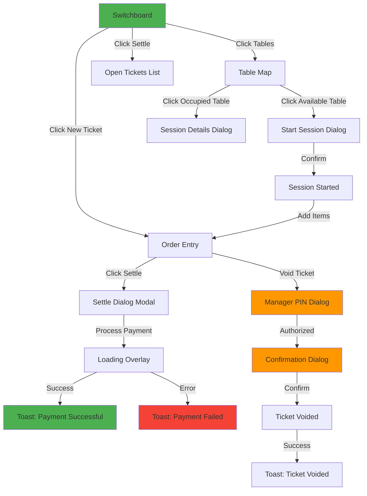

# Design Document: UI Polish and Optimization

## Overview

This design document outlines the technical approach for implementing premium-grade UI polish and optimization for the Magidesk POS system. The design focuses on creating a cohesive, accessible, and performant user interface that meets professional POS standards while leveraging WinUI 3's Fluent Design System.

The implementation follows the existing MVVM architecture and integrates seamlessly with the current Clean Architecture layers. All UI components will be built using WinUI 3 controls, custom controls where necessary, and will maintain consistency with the existing codebase patterns.

## Architecture

### High-Level Component Structure

```
Presentation Layer
├── Views/
│   ├── SwitchboardPage (Redesigned)
│   ├── LoginPage (New)
│   ├── ReservationCalendarPage (New)
│   ├── CustomerListPage (New)
│   ├── MemberManagementPage (New)
│   ├── TableSessionPage (New)
│   ├── InventoryManagementPage (New)
│   └── AuditLogPage (New)
├── Controls/
│   ├── SessionTimerControl (New)
│   ├── ToastNotificationHost (New)
│   ├── LoadingOverlay (New)
│   ├── ManagerPinDialog (New)
│   ├── ConfirmationDialog (New)
│   └── EnhancedTableControl (Enhanced)
├── ViewModels/
│   ├── SwitchboardViewModel (Enhanced)
│   ├── LoginViewModel (New)
│   ├── ReservationCalendarViewModel (New)
│   └── [Other ViewModels] (New/Enhanced)
├── Services/
│   ├── ToastNotificationService (New)
│   ├── KeyboardShortcutService (New)
│   └── AccessibilityService (New)
└── Styles/
    ├── TouchOptimizedStyles.xaml (New)
    ├── AccessibilityStyles.xaml (New)
    └── ConsistentSpacing.xaml (New)
```

### Integration with Existing Architecture

The UI polish components integrate with existing services:
- **NavigationService**: Enhanced to support modal dialogs and context preservation
- **LocalizationService**: All new UI strings use existing localization patterns
- **UserService**: Authentication and permission checks for UI element visibility
- **TerminalContext**: Terminal-specific UI configurations

## Components and Interfaces

### 1. Switchboard Redesign

**Purpose**: Transform the Switchboard from a ticket list into a proper navigation hub with large, touch-optimized buttons.

**Component Structure**:
```xml
<Page x:Class="SwitchboardPage">
  <Grid>
    <Grid.RowDefinitions>
      <RowDefinition Height="Auto"/> <!-- Header -->
      <RowDefinition Height="*"/>    <!-- Button Grid -->
    </Grid.RowDefinitions>
    
    <!-- Header: User, Terminal, Shift Status -->
    <StackPanel Grid.Row="0"/>
    
    <!-- Main Button Grid -->
    <GridView Grid.Row="1" ItemsSource="{x:Bind ViewModel.NavigationButtons}">
      <!-- Large 120x120 buttons with icons and labels -->
    </GridView>
  </Grid>
</Page>
```

**ViewModel Interface**:
```csharp
public class SwitchboardViewModel : ViewModelBase
{
    public ObservableCollection<NavigationButton> NavigationButtons { get; }
    public string CurrentUserName { get; }
    public string TerminalId { get; }
    public string ShiftStatus { get; }
    public int OpenTicketCount { get; }
    public int ActiveSessionCount { get; }
    
    public ICommand NavigateCommand { get; }
    public ICommand RefreshCommand { get; }
}

public class NavigationButton
{
    public string Label { get; set; }
    public string Icon { get; set; } // Segoe Fluent Icons glyph
    public string Route { get; set; }
    public bool IsEnabled { get; set; }
    public string Category { get; set; } // Operations, Management, Reports, Settings
}
```


### 2. Session Timer Control

**Purpose**: Display live elapsed time for table sessions with visual indicators for billing thresholds.

**Control Structure**:
```xml
<UserControl x:Class="SessionTimerControl">
  <Border Background="{x:Bind BackgroundBrush, Mode=OneWay}"
          CornerRadius="4" Padding="8,4">
    <StackPanel Orientation="Horizontal" Spacing="4">
      <FontIcon Glyph="&#xE916;" FontSize="16"/>
      <TextBlock Text="{x:Bind FormattedTime, Mode=OneWay}"
                 FontFamily="Consolas"
                 FontWeight="SemiBold"/>
    </StackPanel>
  </Border>
</UserControl>
```

**Control Interface**:
```csharp
public sealed partial class SessionTimerControl : UserControl
{
    public DateTime SessionStartTime { get; set; }
    public bool IsPaused { get; set; }
    public TimeSpan ElapsedTime { get; }
    public string FormattedTime { get; } // HH:MM:SS or "1d 02:15:30"
    public Brush BackgroundBrush { get; } // Green/Yellow/Red based on thresholds
    
    private DispatcherTimer _timer;
    
    public SessionTimerControl()
    {
        _timer = new DispatcherTimer { Interval = TimeSpan.FromSeconds(1) };
        _timer.Tick += UpdateTime;
    }
    
    private void UpdateTime(object sender, object e)
    {
        // Calculate elapsed time
        // Update FormattedTime property
        // Update BackgroundBrush based on thresholds
    }
}
```

### 3. Toast Notification System

**Purpose**: Provide immediate visual feedback for user actions with auto-dismissing notifications.

**Service Interface**:
```csharp
public interface IToastNotificationService
{
    void ShowSuccess(string message, string title = "Success");
    void ShowError(string message, string title = "Error", string details = null);
    void ShowInfo(string message, string title = "Information");
    void ShowWarning(string message, string title = "Warning");
}

public class ToastNotificationService : IToastNotificationService
{
    private readonly ObservableCollection<ToastNotification> _activeToasts = new();
    private const int MaxVisibleToasts = 3;
    
    public void ShowSuccess(string message, string title = "Success")
    {
        var toast = new ToastNotification
        {
            Type = ToastType.Success,
            Title = title,
            Message = message,
            Icon = "\uE73E", // Checkmark
            Duration = TimeSpan.FromSeconds(4)
        };
        
        AddToast(toast);
    }
    
    private void AddToast(ToastNotification toast)
    {
        if (_activeToasts.Count >= MaxVisibleToasts)
        {
            _activeToasts.RemoveAt(0);
        }
        
        _activeToasts.Add(toast);
        
        var timer = new DispatcherTimer { Interval = toast.Duration };
        timer.Tick += (s, e) => { _activeToasts.Remove(toast); timer.Stop(); };
        timer.Start();
    }
}
```

**Host Control**:
```xml
<UserControl x:Class="ToastNotificationHost">
  <ItemsControl ItemsSource="{x:Bind ToastService.ActiveToasts, Mode=OneWay}"
                VerticalAlignment="Top"
                HorizontalAlignment="Right"
                Margin="0,80,24,0">
    <ItemsControl.ItemTemplate>
      <DataTemplate x:DataType="local:ToastNotification">
        <Border Background="{x:Bind BackgroundBrush}"
                CornerRadius="8"
                Padding="16"
                Margin="0,0,0,8"
                Width="320">
          <!-- Toast content -->
        </Border>
      </DataTemplate>
    </ItemsControl.ItemTemplate>
  </ItemsControl>
</UserControl>
```

### 4. Loading Overlay

**Purpose**: Indicate asynchronous operations and prevent duplicate actions.

**Control Structure**:
```xml
<UserControl x:Class="LoadingOverlay">
  <Grid Background="{ThemeResource SystemControlAcrylicElementBrush}"
        Visibility="{x:Bind IsLoading, Mode=OneWay}">
    <StackPanel HorizontalAlignment="Center"
                VerticalAlignment="Center"
                Spacing="16">
      <ProgressRing IsActive="True" Width="48" Height="48"/>
      <TextBlock Text="{x:Bind LoadingMessage, Mode=OneWay}"
                 Style="{StaticResource SubtitleTextBlockStyle}"/>
      <Button Content="Cancel"
              Visibility="{x:Bind IsCancellable, Mode=OneWay}"
              Command="{x:Bind CancelCommand}"/>
    </StackPanel>
  </Grid>
</UserControl>
```

**Control Interface**:
```csharp
public sealed partial class LoadingOverlay : UserControl
{
    public bool IsLoading { get; set; }
    public string LoadingMessage { get; set; }
    public bool IsCancellable { get; set; }
    public ICommand CancelCommand { get; set; }
}
```


### 5. Manager PIN Dialog

**Purpose**: Authenticate manager privileges for sensitive operations.

**Dialog Structure**:
```xml
<ContentDialog x:Class="ManagerPinDialog"
               Title="Manager Authorization Required"
               PrimaryButtonText="Authorize"
               CloseButtonText="Cancel">
  <StackPanel Spacing="16">
    <TextBlock Text="{x:Bind OperationDescription}"
               TextWrapping="Wrap"/>
    
    <PasswordBox x:Name="PinInput"
                 PlaceholderText="Enter Manager PIN"
                 MaxLength="6"/>
    
    <Grid>
      <!-- Numeric keypad 0-9 -->
    </Grid>
    
    <TextBlock Text="{x:Bind ErrorMessage, Mode=OneWay}"
               Foreground="Red"
               Visibility="{x:Bind HasError, Mode=OneWay}"/>
  </StackPanel>
</ContentDialog>
```

**Dialog Interface**:
```csharp
public sealed partial class ManagerPinDialog : ContentDialog
{
    private readonly ISecurityService _securityService;
    private readonly IAesEncryptionService _encryptionService;
    
    public string OperationDescription { get; set; }
    public string ErrorMessage { get; set; }
    public bool HasError { get; set; }
    public UserDto AuthorizedUser { get; private set; }
    
    public async Task<ManagerAuthResult> ShowForOperationAsync(string operation)
    {
        OperationDescription = $"Authorization required for: {operation}";
        var result = await ShowAsync();
        
        if (result == ContentDialogResult.Primary)
        {
            var pin = PinInput.Password;
            var encryptedPin = _encryptionService.Encrypt(pin);
            var user = await _securityService.GetUserByPinAsync(encryptedPin);
            
            if (user != null && HasManagerPermissions(user))
            {
                AuthorizedUser = user;
                return new ManagerAuthResult { Authorized = true, User = user };
            }
            else
            {
                ErrorMessage = "Invalid PIN or insufficient permissions";
                HasError = true;
                return new ManagerAuthResult { Authorized = false };
            }
        }
        
        return new ManagerAuthResult { Authorized = false };
    }
}

public class ManagerAuthResult
{
    public bool Authorized { get; set; }
    public UserDto User { get; set; }
}
```

### 6. Confirmation Dialog

**Purpose**: Prevent accidental destructive actions with clear confirmation prompts.

**Dialog Structure**:
```xml
<ContentDialog x:Class="ConfirmationDialog"
               Title="{x:Bind Title}"
               PrimaryButtonText="Confirm"
               CloseButtonText="Cancel">
  <StackPanel Spacing="16">
    <InfoBar Severity="Warning"
             IsOpen="True"
             IsClosable="False"
             Message="{x:Bind WarningMessage}"/>
    
    <TextBlock Text="{x:Bind DetailMessage}"
               TextWrapping="Wrap"/>
    
    <Border Background="{ThemeResource CardBackgroundFillColorDefaultBrush}"
            BorderBrush="{ThemeResource CardStrokeColorDefaultBrush}"
            BorderThickness="1"
            CornerRadius="4"
            Padding="12">
      <!-- Display relevant details (ticket #, amount, etc.) -->
      <StackPanel Spacing="8">
        <TextBlock Text="{x:Bind DetailLabel1}"/>
        <TextBlock Text="{x:Bind DetailValue1}" FontWeight="SemiBold"/>
      </StackPanel>
    </Border>
  </StackPanel>
</ContentDialog>
```

**Dialog Interface**:
```csharp
public sealed partial class ConfirmationDialog : ContentDialog
{
    public string Title { get; set; }
    public string WarningMessage { get; set; }
    public string DetailMessage { get; set; }
    public Dictionary<string, string> Details { get; set; }
    
    public static async Task<bool> ShowAsync(
        string title,
        string warning,
        string detail,
        Dictionary<string, string> details = null)
    {
        var dialog = new ConfirmationDialog
        {
            Title = title,
            WarningMessage = warning,
            DetailMessage = detail,
            Details = details ?? new Dictionary<string, string>()
        };
        
        dialog.XamlRoot = App.MainWindowInstance.Content.XamlRoot;
        var result = await dialog.ShowAsync();
        
        return result == ContentDialogResult.Primary;
    }
}
```

### 7. Enhanced Table Control

**Purpose**: Add interactive capabilities to table visualizations on the floor map.

**Enhanced Features**:
- Context menu on right-click
- Session timer overlay when occupied
- Visual status indicators (color-coded borders)
- Hover tooltips with session details
- Drag-and-drop for server assignment

**Control Interface**:
```csharp
public sealed partial class EnhancedTableControl : UserControl
{
    public TableDto Table { get; set; }
    public TableSessionDto ActiveSession { get; set; }
    public TableStatus Status { get; set; }
    
    public event EventHandler<TableActionEventArgs> TableClicked;
    public event EventHandler<TableActionEventArgs> TableRightClicked;
    public event EventHandler<ServerAssignmentEventArgs> ServerAssigned;
    
    private void OnPointerPressed(object sender, PointerRoutedEventArgs e)
    {
        var pointer = e.GetCurrentPoint(this);
        
        if (pointer.Properties.IsRightButtonPressed)
        {
            ShowContextMenu();
        }
        else
        {
            TableClicked?.Invoke(this, new TableActionEventArgs { Table = Table });
        }
    }
    
    private void ShowContextMenu()
    {
        var menu = new MenuFlyout();
        
        if (Status == TableStatus.Available)
        {
            menu.Items.Add(new MenuFlyoutItem
            {
                Text = "Start Session",
                Icon = new SymbolIcon(Symbol.Play),
                Command = StartSessionCommand
            });
        }
        else if (Status == TableStatus.Occupied)
        {
            menu.Items.Add(new MenuFlyoutItem
            {
                Text = "View Details",
                Icon = new SymbolIcon(Symbol.View),
                Command = ViewDetailsCommand
            });
            menu.Items.Add(new MenuFlyoutItem
            {
                Text = "End Session",
                Icon = new SymbolIcon(Symbol.Stop),
                Command = EndSessionCommand
            });
        }
        
        menu.ShowAt(this);
    }
}
```


## Data Models

### Toast Notification Model

```csharp
public class ToastNotification : ObservableObject
{
    public ToastType Type { get; set; }
    public string Title { get; set; }
    public string Message { get; set; }
    public string Icon { get; set; } // Segoe Fluent Icons glyph
    public TimeSpan Duration { get; set; }
    public Brush BackgroundBrush => Type switch
    {
        ToastType.Success => new SolidColorBrush(Colors.Green),
        ToastType.Error => new SolidColorBrush(Colors.Red),
        ToastType.Warning => new SolidColorBrush(Colors.Orange),
        ToastType.Info => new SolidColorBrush(Colors.Blue),
        _ => new SolidColorBrush(Colors.Gray)
    };
}

public enum ToastType
{
    Success,
    Error,
    Warning,
    Info
}
```

### Navigation Button Model

```csharp
public class NavigationButton : ObservableObject
{
    public string Label { get; set; }
    public string Icon { get; set; }
    public string Route { get; set; }
    public string Category { get; set; }
    public bool IsEnabled { get; set; }
    public UserPermission RequiredPermission { get; set; }
    public string KeyboardShortcut { get; set; }
}
```

### Keyboard Shortcut Model

```csharp
public class KeyboardShortcut
{
    public VirtualKey Key { get; set; }
    public VirtualKeyModifiers Modifiers { get; set; }
    public string ActionName { get; set; }
    public ICommand Command { get; set; }
}
```

## Correctness Properties

*A property is a characteristic or behavior that should hold true across all valid executions of a system—essentially, a formal statement about what the system should do. Properties serve as the bridge between human-readable specifications and machine-verifiable correctness guarantees.*

### Property 1: Toast Notification Auto-Dismissal

*For any* toast notification with a specified duration, displaying the notification and waiting for the duration should result in the notification being automatically removed from the active toasts collection.

**Validates: Requirements 3.4**

### Property 2: Session Timer Accuracy

*For any* active table session, the session timer should display elapsed time that matches the actual time difference between the current time and session start time (within 1 second tolerance).

**Validates: Requirements 2.1, 2.2**

### Property 3: Manager PIN Authorization

*For any* privileged operation, attempting the operation without valid manager authentication should be blocked, and attempting with valid manager authentication should be allowed.

**Validates: Requirements 5.4, 5.5**

### Property 4: Touch Target Minimum Size

*For any* interactive UI element, the element's hit test area should be at least 44x44 pixels to ensure touch accessibility.

**Validates: Requirements 11.1**

### Property 5: Keyboard Shortcut Uniqueness

*For any* two keyboard shortcuts in the system, they should not have the same key combination to prevent conflicts.

**Validates: Requirements 10.8**

### Property 6: Loading Overlay Blocking

*For any* asynchronous operation with a loading overlay displayed, all interactive elements should be disabled until the operation completes.

**Validates: Requirements 4.2**

### Property 7: Confirmation Dialog for Destructive Actions

*For any* destructive action (void, delete, refund), the action should not execute without user confirmation through the confirmation dialog.

**Validates: Requirements 6.1, 6.4, 6.5**

### Property 8: Accessibility Name Presence

*For any* interactive UI element, the element should have an AutomationProperties.Name set for screen reader support.

**Validates: Requirements 12.1**

### Property 9: Visual Feedback on Touch

*For any* touch input on an interactive element, the element should provide immediate visual feedback (within 100ms).

**Validates: Requirements 11.3**

### Property 10: Toast Notification Stack Limit

*For any* sequence of toast notifications, the number of simultaneously visible toasts should never exceed 3.

**Validates: Requirements 3.7**

### Property 11: Dialog Context Preservation

*For any* modal dialog operation, closing the dialog should return the user to the exact same UI state they were in before opening the dialog.

**Validates: Requirements 9.6**

### Property 12: Permission-Based Button Visibility

*For any* navigation button requiring specific permissions, the button should only be enabled when the current user has the required permission.

**Validates: Requirements 1.6**


## Error Handling

### UI Error Handling Strategy

All UI components follow a consistent error handling pattern:

1. **Graceful Degradation**: UI continues to function even if non-critical features fail
2. **User-Friendly Messages**: Technical errors are translated to actionable user messages
3. **Error Recovery**: Provide retry mechanisms for transient failures
4. **Error Logging**: All errors are logged with full context for troubleshooting

### Error Scenarios and Handling

#### 1. Toast Notification Service Failure

**Scenario**: Toast notification service fails to display a notification

**Handling**:
```csharp
public void ShowSuccess(string message, string title = "Success")
{
    try
    {
        var toast = new ToastNotification { /* ... */ };
        AddToast(toast);
    }
    catch (Exception ex)
    {
        _logger.LogError(ex, "Failed to display toast notification");
        // Fallback: Use ContentDialog for critical messages
        if (IsCriticalMessage(message))
        {
            await ShowFallbackDialog(message, title);
        }
    }
}
```

#### 2. Session Timer Update Failure

**Scenario**: Timer fails to update due to UI thread issues

**Handling**:
```csharp
private void UpdateTime(object sender, object e)
{
    try
    {
        DispatcherQueue.TryEnqueue(() =>
        {
            ElapsedTime = DateTime.Now - SessionStartTime;
            FormattedTime = FormatElapsedTime(ElapsedTime);
            UpdateBackgroundBrush();
        });
    }
    catch (Exception ex)
    {
        _logger.LogError(ex, "Session timer update failed for session {SessionId}", SessionId);
        // Continue running - don't crash the UI
        // Display error indicator on the timer control
        FormattedTime = "ERROR";
    }
}
```

#### 3. Manager PIN Authentication Failure

**Scenario**: Authentication service is unavailable

**Handling**:
```csharp
public async Task<ManagerAuthResult> ShowForOperationAsync(string operation)
{
    try
    {
        var result = await ShowAsync();
        
        if (result == ContentDialogResult.Primary)
        {
            var user = await _securityService.GetUserByPinAsync(encryptedPin);
            // ... authentication logic
        }
    }
    catch (Exception ex)
    {
        _logger.LogError(ex, "Manager authentication failed for operation: {Operation}", operation);
        
        await ShowErrorDialog(
            "Authentication Error",
            "Unable to verify manager credentials. Please check your connection and try again.",
            ex.Message
        );
        
        return new ManagerAuthResult { Authorized = false, Error = ex.Message };
    }
}
```

#### 4. Loading Overlay Stuck State

**Scenario**: Async operation completes but overlay doesn't dismiss

**Handling**:
```csharp
public class LoadingOverlayService
{
    private readonly TimeSpan _maxLoadingDuration = TimeSpan.FromSeconds(30);
    
    public async Task ShowDuringOperationAsync(Func<Task> operation, string message)
    {
        var cts = new CancellationTokenSource(_maxLoadingDuration);
        
        try
        {
            IsLoading = true;
            LoadingMessage = message;
            
            await operation();
        }
        catch (OperationCanceledException)
        {
            _logger.LogWarning("Loading operation timed out after {Duration}", _maxLoadingDuration);
            await ShowErrorToast("Operation timed out. Please try again.");
        }
        finally
        {
            IsLoading = false; // Always dismiss overlay
        }
    }
}
```

#### 5. Keyboard Shortcut Conflict

**Scenario**: Multiple commands registered for the same key combination

**Handling**:
```csharp
public class KeyboardShortcutService
{
    private readonly Dictionary<string, KeyboardShortcut> _shortcuts = new();
    
    public void RegisterShortcut(KeyboardShortcut shortcut)
    {
        var key = GetShortcutKey(shortcut);
        
        if (_shortcuts.ContainsKey(key))
        {
            _logger.LogWarning(
                "Keyboard shortcut conflict: {Key} already registered for {ExistingAction}, cannot register for {NewAction}",
                key,
                _shortcuts[key].ActionName,
                shortcut.ActionName
            );
            
            throw new InvalidOperationException(
                $"Keyboard shortcut {key} is already registered for {_shortcuts[key].ActionName}"
            );
        }
        
        _shortcuts[key] = shortcut;
    }
}
```

### Error Notification Patterns

#### Critical Errors (Block Operation)
```csharp
await _navigationService.ShowErrorAsync(
    "Critical Error",
    "Unable to complete operation. Please contact support.",
    errorDetails
);
```

#### Recoverable Errors (Allow Retry)
```csharp
var retry = await ShowRetryDialog(
    "Operation Failed",
    "The operation failed due to a temporary issue. Would you like to retry?",
    errorDetails
);

if (retry)
{
    await RetryOperation();
}
```

#### Non-Critical Errors (Toast Notification)
```csharp
_toastService.ShowError(
    "Unable to refresh data. Using cached information.",
    "Refresh Failed"
);
```

## Testing Strategy

### Unit Testing

Unit tests will verify specific UI component behaviors and edge cases:

1. **Toast Notification Tests**
   - Test auto-dismissal after specified duration
   - Test maximum visible toast limit (3)
   - Test toast stacking behavior
   - Test manual dismissal

2. **Session Timer Tests**
   - Test time formatting (HH:MM:SS, days format)
   - Test pause/resume behavior
   - Test threshold color changes
   - Test timer accuracy

3. **Manager PIN Dialog Tests**
   - Test valid PIN acceptance
   - Test invalid PIN rejection
   - Test permission validation
   - Test audit logging

4. **Confirmation Dialog Tests**
   - Test confirm action execution
   - Test cancel action abortion
   - Test detail display

5. **Loading Overlay Tests**
   - Test overlay display/dismiss
   - Test element disabling during loading
   - Test cancellation support

### Property-Based Testing

Property-based tests will verify universal properties across all inputs using the existing test framework. Each test will run a minimum of 100 iterations.

**Test Configuration**:
- Framework: Use existing C# property-based testing library (e.g., FsCheck, CsCheck)
- Iterations: Minimum 100 per property test
- Tagging: Each test tagged with feature name and property number

**Property Test Examples**:

```csharp
[Fact]
public void Property1_ToastNotificationAutoDismissal()
{
    // Feature: ui-polish-optimization, Property 1: Toast Notification Auto-Dismissal
    // For any toast notification with a specified duration,
    // displaying and waiting should result in automatic removal
    
    Prop.ForAll<int>(duration =>
    {
        var service = new ToastNotificationService();
        var toast = new ToastNotification
        {
            Duration = TimeSpan.FromSeconds(Math.Max(1, duration % 10))
        };
        
        service.AddToast(toast);
        Assert.Contains(toast, service.ActiveToasts);
        
        Thread.Sleep(toast.Duration + TimeSpan.FromMilliseconds(100));
        
        return !service.ActiveToasts.Contains(toast);
    }).QuickCheckThrowOnFailure();
}

[Fact]
public void Property4_TouchTargetMinimumSize()
{
    // Feature: ui-polish-optimization, Property 4: Touch Target Minimum Size
    // For any interactive UI element, hit test area should be at least 44x44 pixels
    
    Prop.ForAll<string>(buttonText =>
    {
        var button = new Button { Content = buttonText };
        button.Measure(new Size(double.PositiveInfinity, double.PositiveInfinity));
        
        var width = button.DesiredSize.Width;
        var height = button.DesiredSize.Height;
        
        return width >= 44 && height >= 44;
    }).QuickCheckThrowOnFailure();
}
```

### Integration Testing

Integration tests will verify UI components work correctly with backend services:

1. **Switchboard Navigation Tests**
   - Test navigation to all pages
   - Test permission-based button visibility
   - Test keyboard shortcut execution

2. **Manager Authentication Flow Tests**
   - Test end-to-end authentication for privileged operations
   - Test audit log creation
   - Test permission validation

3. **Table Map Interaction Tests**
   - Test session start from table click
   - Test context menu display
   - Test server assignment drag-and-drop

### Manual Testing Checklist

1. **Accessibility Testing**
   - Test with Windows Narrator
   - Test keyboard-only navigation
   - Test high contrast themes
   - Test with 200% font scaling

2. **Touch Testing**
   - Test all buttons on touchscreen device
   - Test swipe gestures
   - Test on-screen keyboard triggers

3. **Performance Testing**
   - Measure button click response time (target: <100ms)
   - Measure page load time (target: <500ms)
   - Monitor animation frame rate (target: 60 FPS)

4. **Visual Consistency Testing**
   - Verify consistent spacing across all pages
   - Verify consistent color usage
   - Verify consistent typography


## Visual Mockups and Previews

### 1. Switchboard Page Redesign

```
┌─────────────────────────────────────────────────────────────────────────┐
│  MAGIDESK POS                                    User: John Smith       │
│                                                   Terminal: POS-01       │
│                                                   Shift: Open (3h 24m)   │
│                                                   Open Tickets: 12       │
│                                                   Active Sessions: 8     │
├─────────────────────────────────────────────────────────────────────────┤
│                                                                          │
│  OPERATIONS                                                              │
│  ┌──────────┐  ┌──────────┐  ┌──────────┐  ┌──────────┐               │
│  │  [📝]    │  │  [🍽️]    │  │  [💳]    │  │  [🔍]    │               │
│  │          │  │          │  │          │  │          │               │
│  │   New    │  │  Tables  │  │  Settle  │  │  Search  │               │
│  │  Ticket  │  │   F2     │  │   F12    │  │  Ticket  │               │
│  │   F1     │  │          │  │          │  │   F3     │               │
│  └──────────┘  └──────────┘  └──────────┘  └──────────┘               │
│                                                                          │
│  ┌──────────┐  ┌──────────┐  ┌──────────┐  ┌──────────┐               │
│  │  [👥]    │  │  [📅]    │  │  [🍴]    │  │  [🖨️]    │               │
│  │          │  │          │  │          │  │          │               │
│  │Customers │  │Reserv-   │  │  Order   │  │  Kitchen │               │
│  │          │  │ations    │  │  Entry   │  │  Display │               │
│  │          │  │          │  │          │  │          │               │
│  └──────────┘  └──────────┘  └──────────┘  └──────────┘               │
│                                                                          │
│  MANAGEMENT                                                              │
│  ┌──────────┐  ┌──────────┐  ┌──────────┐  ┌──────────┐               │
│  │  [⚙️]    │  │  [📊]    │  │  [💰]    │  │  [👤]    │               │
│  │          │  │          │  │          │  │          │               │
│  │ Manager  │  │ Reports  │  │  Drawer  │  │  Back    │               │
│  │Functions │  │          │  │   Pull   │  │  Office  │               │
│  │          │  │          │  │          │  │          │               │
│  └──────────┘  └──────────┘  └──────────┘  └──────────┘               │
│                                                                          │
│  QUICK ACTIONS                                                           │
│  ┌──────────┐  ┌──────────┐  ┌──────────┐  ┌──────────┐               │
│  │  [🔄]    │  │  [🚪]    │  │  [⏰]    │  │  [🔌]    │               │
│  │ Refresh  │  │  Logout  │  │Clock In/ │  │ Shutdown │               │
│  │   F5     │  │          │  │   Out    │  │          │               │
│  └──────────┘  └──────────┘  └──────────┘  └──────────┘               │
│                                                                          │
└─────────────────────────────────────────────────────────────────────────┘
```

**Key Features**:
- Large 120x120px touch-optimized buttons
- Grouped by function (Operations, Management, Quick Actions)
- Keyboard shortcuts displayed on buttons (F1-F12)
- Header shows user context, terminal, shift status, and live counts
- Icons from Segoe Fluent Icons font
- Disabled buttons grayed out based on permissions

### 2. Toast Notification System

```
                                                    ┌──────────────────────┐
                                                    │  ✓  Success          │
                                                    │                      │
                                                    │  Ticket #1234 saved  │
                                                    │  successfully        │
                                                    │                   [X]│
                                                    └──────────────────────┘
                                                    
                                                    ┌──────────────────────┐
                                                    │  ⓘ  Information      │
                                                    │                      │
                                                    │  Session paused for  │
                                                    │  Table 5             │
                                                    │                   [X]│
                                                    └──────────────────────┘
                                                    
                                                    ┌──────────────────────┐
                                                    │  ⚠  Error            │
                                                    │                      │
                                                    │  Failed to print     │
                                                    │  receipt. Check      │
                                                    │  printer connection  │
                                                    │                   [X]│
                                                    └──────────────────────┘
```

**Key Features**:
- Stacked in top-right corner (max 3 visible)
- Color-coded by type (green/blue/red/yellow)
- Auto-dismiss after 4-8 seconds
- Manual dismiss with X button
- Icon indicates notification type

### 3. Session Timer Control

```
┌─────────────────────┐
│  🕐  02:34:15       │  ← Green (normal)
└─────────────────────┘

┌─────────────────────┐
│  🕐  00:52:30       │  ← Yellow (approaching threshold)
└─────────────────────┘

┌─────────────────────┐
│  🕐  00:57:45       │  ← Red (over threshold)
└─────────────────────┘

┌─────────────────────┐
│  ⏸️  PAUSED         │  ← Gray (paused state)
└─────────────────────┘

┌─────────────────────┐
│  🕐  1d 02:15:30    │  ← Shows days for long sessions
└─────────────────────┘
```

**Key Features**:
- Monospace font for consistent width
- Color changes based on billing thresholds
- Shows pause state clearly
- Handles multi-day sessions
- Updates every second

### 4. Manager PIN Dialog

```
┌─────────────────────────────────────────────────┐
│  Manager Authorization Required            [X]  │
├─────────────────────────────────────────────────┤
│                                                  │
│  Authorization required for: Void Ticket #1234  │
│                                                  │
│  ┌────────────────────────────────────────────┐ │
│  │  Enter Manager PIN: ●●●●●●                 │ │
│  └────────────────────────────────────────────┘ │
│                                                  │
│  ┌─────┬─────┬─────┐                            │
│  │  1  │  2  │  3  │                            │
│  ├─────┼─────┼─────┤                            │
│  │  4  │  5  │  6  │                            │
│  ├─────┼─────┼─────┤                            │
│  │  7  │  8  │  9  │                            │
│  ├─────┼─────┼─────┤                            │
│  │  ←  │  0  │  ✓  │                            │
│  └─────┴─────┴─────┘                            │
│                                                  │
│  ⚠ Invalid PIN or insufficient permissions      │
│                                                  │
│  [    Authorize    ]  [    Cancel    ]          │
└─────────────────────────────────────────────────┘
```

**Key Features**:
- Clear operation description
- Masked PIN entry (●●●●●●)
- Large numeric keypad for touch
- Error message display
- Backspace and confirm buttons

### 5. Confirmation Dialog

```
┌─────────────────────────────────────────────────┐
│  Confirm Void Ticket                       [X]  │
├─────────────────────────────────────────────────┤
│                                                  │
│  ⚠ WARNING: This action cannot be undone        │
│                                                  │
│  You are about to void the following ticket:    │
│                                                  │
│  ┌────────────────────────────────────────────┐ │
│  │  Ticket Number:  #1234                     │ │
│  │  Table:          Table 5                   │ │
│  │  Amount:         $45.50                    │ │
│  │  Server:         Jane Doe                  │ │
│  │  Created:        2:30 PM                   │ │
│  └────────────────────────────────────────────┘ │
│                                                  │
│  This will:                                      │
│  • Remove all charges from the ticket           │
│  • Log the void action in the audit trail       │
│  • Notify the manager                           │
│                                                  │
│  [    Confirm Void    ]  [    Cancel    ]       │
└─────────────────────────────────────────────────┘
```

**Key Features**:
- Warning banner at top
- Clear description of action
- Detailed information card
- List of consequences
- Distinct button styling (red for destructive)

### 6. Loading Overlay

```
┌─────────────────────────────────────────────────┐
│                                                  │
│                                                  │
│                                                  │
│                  ⏳ Loading...                   │
│                                                  │
│              Processing payment...               │
│                                                  │
│                                                  │
│                  [  Cancel  ]                    │
│                                                  │
│                                                  │
│                                                  │
└─────────────────────────────────────────────────┘
```

**Key Features**:
- Semi-transparent backdrop
- Centered spinner and message
- Descriptive loading message
- Optional cancel button
- Blocks all interaction with underlying content

### 7. Enhanced Table Map with Session Timers

```
┌─────────────────────────────────────────────────────────────────────────┐
│  Floor: Main Dining                                              [Edit] │
├─────────────────────────────────────────────────────────────────────────┤
│                                                                          │
│  ┌──────────┐  ┌──────────┐  ┌──────────┐  ┌──────────┐               │
│  │ Table 1  │  │ Table 2  │  │ Table 3  │  │ Table 4  │               │
│  │          │  │ 🕐 01:23 │  │          │  │ 🕐 00:45 │               │
│  │ Available│  │ $23.50   │  │ Reserved │  │ $18.75   │               │
│  │          │  │ Jane D.  │  │ 3:00 PM  │  │ John S.  │               │
│  └──────────┘  └──────────┘  └──────────┘  └──────────┘               │
│   (Green)       (Red)         (Yellow)       (Red)                      │
│                                                                          │
│  ┌──────────┐  ┌──────────┐  ┌──────────┐  ┌──────────┐               │
│  │ Table 5  │  │ Table 6  │  │ Table 7  │  │ Table 8  │               │
│  │ 🕐 02:15 │  │          │  │ 🕐 00:12 │  │          │               │
│  │ $45.00   │  │  Dirty   │  │ $8.50    │  │ Available│               │
│  │ Mike R.  │  │          │  │ Sarah L. │  │          │               │
│  └──────────┘  └──────────┘  └──────────┘  └──────────┘               │
│   (Red)         (Gray)        (Red)         (Green)                     │
│                                                                          │
│  Legend:  🟢 Available  🔴 Occupied  🟡 Reserved  ⚫ Dirty               │
│                                                                          │
│  Right-click table for options | Click to view details                  │
└─────────────────────────────────────────────────────────────────────────┘
```

**Key Features**:
- Color-coded table status (green/red/yellow/gray)
- Live session timers on occupied tables
- Current charges displayed
- Server name shown
- Interactive (click/right-click for actions)
- Legend for status colors

### 8. Login Page

```
┌─────────────────────────────────────────────────┐
│                                                  │
│              🏪 MAGIDESK POS                     │
│                                                  │
│              Terminal: POS-01                    │
│                                                  │
│  ┌────────────────────────────────────────────┐ │
│  │  Select User:                              │ │
│  │                                            │ │
│  │  ┌──────────┐  ┌──────────┐  ┌──────────┐│ │
│  │  │  [👤]    │  │  [👤]    │  │  [👤]    ││ │
│  │  │          │  │          │  │          ││ │
│  │  │  John    │  │  Jane    │  │  Mike    ││ │
│  │  │  Smith   │  │   Doe    │  │ Roberts  ││ │
│  │  │          │  │          │  │          ││ │
│  │  │ Manager  │  │  Server  │  │  Server  ││ │
│  │  └──────────┘  └──────────┘  └──────────┘│ │
│  │                                            │ │
│  │  ┌──────────┐  ┌──────────┐  ┌──────────┐│ │
│  │  │  [👤]    │  │  [👤]    │  │  [+]     ││ │
│  │  │  Sarah   │  │  Admin   │  │  Other   ││ │
│  │  │  Lee     │  │  User    │  │  User    ││ │
│  │  └──────────┘  └──────────┘  └──────────┘│ │
│  └────────────────────────────────────────────┘ │
│                                                  │
│  ┌────────────────────────────────────────────┐ │
│  │  Enter PIN: ●●●●●●                         │ │
│  └────────────────────────────────────────────┘ │
│                                                  │
│  ┌─────┬─────┬─────┐                            │
│  │  1  │  2  │  3  │                            │
│  ├─────┼─────┼─────┤                            │
│  │  4  │  5  │  6  │                            │
│  ├─────┼─────┼─────┤                            │
│  │  7  │  8  │  9  │                            │
│  ├─────┼─────┼─────┤                            │
│  │  ←  │  0  │  ✓  │                            │
│  └─────┴─────┴─────┘                            │
│                                                  │
│                [    Login    ]                   │
│                                                  │
│  v2.1.0                          [⚙️ Settings]   │
└─────────────────────────────────────────────────┘
```

**Key Features**:
- Large user selection tiles with photos/avatars
- Role displayed under each user
- PIN entry with numeric keypad
- Masked PIN display
- Settings access for terminal configuration
- Version number displayed

### 9. Reservation Calendar Page

```
┌─────────────────────────────────────────────────────────────────────────┐
│  Reservations                                    [+ New Reservation]    │
├─────────────────────────────────────────────────────────────────────────┤
│  [◀ Day] [Week] [Month ▶]          January 13, 2026                    │
├─────────────────────────────────────────────────────────────────────────┤
│                                                                          │
│  Time  │ Table 1 │ Table 2 │ Table 3 │ Table 4 │ Table 5 │ Table 6    │
│  ──────┼─────────┼─────────┼─────────┼─────────┼─────────┼─────────   │
│  12:00 │         │         │         │         │         │            │
│  12:30 │         │ ┌─────┐ │         │         │         │            │
│  13:00 │         │ │Smith│ │         │ ┌─────┐ │         │            │
│  13:30 │         │ │ 4p  │ │         │ │Jones│ │         │            │
│  14:00 │         │ └─────┘ │         │ │ 2p  │ │         │            │
│  14:30 │         │         │         │ └─────┘ │         │            │
│  15:00 │ ┌─────┐ │         │         │         │         │            │
│  15:30 │ │Brown│ │         │         │         │ ┌─────┐ │            │
│  16:00 │ │ 6p  │ │         │         │         │ │Davis│ │            │
│  16:30 │ └─────┘ │         │         │         │ │ 3p  │ │            │
│  17:00 │         │         │         │         │ └─────┘ │            │
│  17:30 │         │         │         │         │         │            │
│  18:00 │         │         │         │         │         │            │
│                                                                          │
│  Legend:  🟢 Available  🔵 Reserved  🔴 Occupied  ⚠️ Conflict           │
│                                                                          │
│  Click to create reservation | Drag to resize | Right-click for options │
└─────────────────────────────────────────────────────────────────────────┘
```

**Key Features**:
- Day/Week/Month view toggle
- Time-slot grid with 30-minute intervals
- Visual reservation blocks with customer name and party size
- Drag-to-create new reservations
- Drag-to-resize reservation duration
- Color-coded status (available/reserved/occupied/conflict)
- Right-click context menu for edit/cancel

### 10. Component Interaction Flow



**Key Interaction Patterns**:
- Modal dialogs preserve context (don't navigate away)
- Loading overlays block interaction during async operations
- Toast notifications provide immediate feedback
- Manager PIN required for privileged operations
- Confirmation dialogs prevent accidental destructive actions

