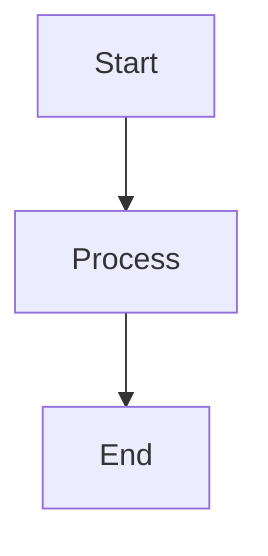

# Contributing to Magidesk POS Documentation

This guide covers how to contribute to the Magidesk POS documentation portal.

## Quick Start

### Prerequisites
- Python 3.8+ with pip
- Git
- Basic Markdown knowledge

### Local Development

1. **Clone Repository**
   ```bash
   git clone https://github.com/your-org/magidesk-pos.git
   cd magidesk-pos
   ```

2. **Setup Environment**
   ```bash
   # Windows
   .\run-docs-locally.ps1
   
   # Linux/Mac
   ./run-docs-locally.sh
   ```

3. **Make Changes**
   - Edit Markdown files in `/docs` directory
   - Update navigation in `mkdocs.yml` if adding new pages
   - Test locally at http://127.0.0.1:8000

4. **Submit Changes**
   ```bash
   git add .
   git commit -m "docs: Add/update documentation"
   git push origin feature-branch
   ```

## Documentation Structure

### Main Sections
- **System**: Vision, capabilities, glossary
- **Architecture**: System overview, module map
- **UI**: Design system, flows, mockups
- **Backend**: API, services, patterns
- **Data**: Models, schemas, migrations
- **Workflows**: Business processes
- **Configuration**: Setup and security
- **Operations**: Deployment and maintenance
- **Runbooks**: Troubleshooting and procedures
- **Contributing**: Development guidelines

### File Organization
```
docs/
├── section-name/
│   ├── index.md          # Section overview
│   ├── topic-1.md        # Specific topic
│   └── topic-2.md        # Another topic
└── README.md             # Main portal entry
```

## Writing Guidelines

### Markdown Standards
- Use standard Markdown syntax
- Include proper heading hierarchy (H1, H2, H3)
- Add alt text for images
- Use code blocks with language specification

### Content Guidelines
- **Be Comprehensive**: Cover topics completely
- **Be Accurate**: Ensure all information is correct
- **Be Current**: Keep documentation up to date
- **Be Clear**: Use simple, direct language
- **Be Consistent**: Follow established patterns

### Code Examples
```csharp
// Always specify language for syntax highlighting
public class Example
{
    public void Method()
    {
        // Code here
    }
}
```

### Diagrams
Use ASCII art or Mermaid diagrams:



## Navigation Updates

When adding new pages, update `mkdocs.yml`:

```yaml
nav:
  - Section Name:
    - New Page: section/new-page.md
```

## Review Process

1. **Self-Review**
   - Test locally
   - Check links
   - Verify formatting

2. **Peer Review**
   - Create pull request
   - Request review from team
   - Address feedback

3. **Merge**
   - Ensure CI passes
   - Merge to main branch
   - Auto-deploy to GitHub Pages

## Getting Help

- **Issues**: Use GitHub Issues for problems
- **Discussions**: Use GitHub Discussions for questions
- **Documentation**: See [docs-portal.md](docs-portal.md) for detailed guide

## Style Guide

### Headings
- H1: Page title (one per page)
- H2: Main sections
- H3: Subsections
- H4: Detailed topics

### Links
- **Internal**: Use relative paths `[Text](../section/page.md)`
- **External**: Use full URLs `[Text](https://example.com)`
- **Anchors**: Use `#heading` for page anchors

### Lists
- Use bullet points for unordered lists
- Use numbered lists for sequences
- Maintain consistent indentation

### Code
- Inline code with backticks `code`
- Code blocks with triple backticks
- Specify language for syntax highlighting

### Tables
| Header 1 | Header 2 |
|----------|----------|
| Cell 1   | Cell 2   |

### Callouts
```markdown
!!! note "Note Title"
    Important information

!!! warning "Warning"
    Caution required

!!! tip "Tip"
    Helpful suggestion
```

Thank you for contributing to the Magidesk POS documentation!