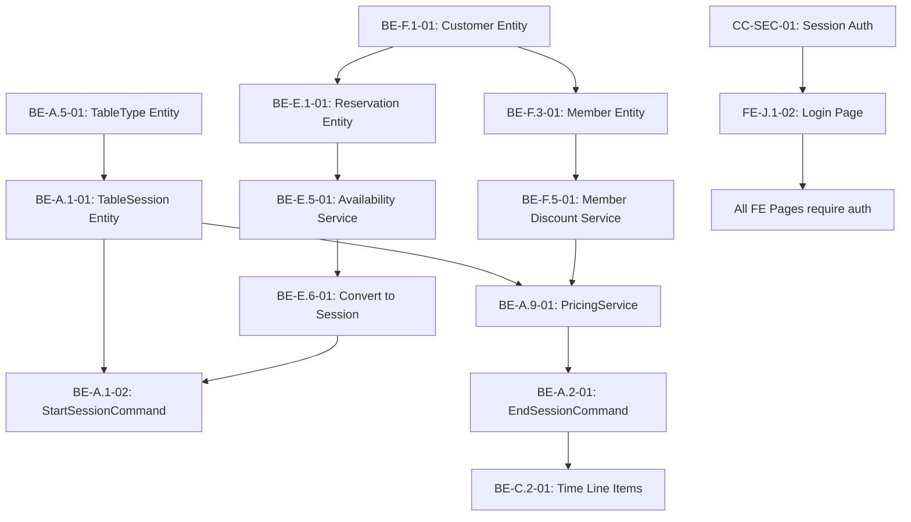

# SSI-INFORBILLIAR Delivery Plan - Summary

> **Generated**: 2026-01-08  
> **Source**: Feature Audit dated 2026-01-08  
> **Total Features**: 126 across 13 categories

---

## Executive Overview

This delivery plan translates the SSI-INFORBILLIAR feature parity audit into **140 actionable development tickets** organized by priority, category, and layer (backend/frontend).

### Current State
- **Fully Implemented**: 37 features (29.4%)
- **Partially Implemented**: 44 features (34.9%)
- **Not Implemented**: 45 features (35.7%)

### Critical Gaps (P0 Priority)
| Category | Gap Description |
|----------|-----------------|
| **A. Table & Game** | Core time-based billing - Session start/end/pause entirely missing |
| **E. Reservations** | Entire module missing (0/12 features) |
| **F. Customer/Member** | Entire module missing (0/13 features) |
| **J. Security** | No login page - critical security gap |

---

## Ticket Summary

| Layer | P0 | P1 | P2 | Total |
|-------|-----|-----|-----|-------|
| Backend | 25 | 30 | 28 | **83** |
| Frontend | 16 | 14 | 10 | **40** |
| Cross-Cutting | 8 | 8 | 1 | **17** |
| **Total** | **49** | **52** | **39** | **140** |

---

## Delivery Structure

```
SSI-INFORBILLIAR-Delivery-Plan/
├── 00-Delivery-Overview/
│   └── Delivery-Strategy.md         # Phased approach and priorities
├── 01-Feature-Index/
│   └── Feature-to-Ticket-Matrix.md  # Master feature-to-ticket mapping
├── 02-Backend-Tickets/
│   ├── A-Table-Game-Management/     # 20 tickets
│   ├── B-Floor-Layout-Management/   # 4 tickets
│   ├── C-Billing-Payments-Pricing/  # 11 tickets
│   ├── D-Tax-Currency-Financial/    # 3 tickets
│   ├── E-Reservations-Scheduling/   # 13 tickets
│   ├── F-Customer-Member-Management/# 13 tickets
│   ├── G-Inventory-Products/        # 7 tickets
│   ├── H-Reporting-Export/          # 10 tickets
│   ├── I-Hardware-Peripherals/      # 5 tickets
│   └── J-M-Combined/                # 11 tickets
├── 03-Frontend-Tickets/
│   ├── A-Table-Game-Management/     # 10 tickets
│   ├── E-Reservations-Scheduling/   # 7 tickets
│   ├── F-Customer-Member-Management/# 8 tickets
│   └── Consolidated-B-D-G-M/        # 21 tickets
├── 04-Cross-Cutting/
│   └── Cross-Cutting-Tickets.md     # 17 infrastructure tickets
├── 05-Progress-Tracking/
│   ├── Ticket-Status.md             # Machine-updatable status tracker
│   └── Feature-Completion.md        # Feature-level progress
└── 99-Governance/
    ├── Guardrail-Compliance.md      # Quality gate mapping
    └── Definition-of-Done.md        # Completion criteria
```

---

## Recommended Phase Sequence

### Phase 1: Foundation (Weeks 1-4) — P0 Backend
- Database migrations for new entities
- TableSession & TableType entities
- Reservation entity
- Customer & Member entities
- PricingService implementation
- Session authentication service

**Tickets**: 25 backend P0 + 8 cross-cutting P0 = **33 tickets**

### Phase 2: Core UI (Weeks 5-8) — P0 Frontend
- Login page (security critical)
- Session dialogs (start/end/pause)
- Reservation calendar
- Customer management pages
- Manager PIN dialog

**Tickets**: 16 frontend P0 = **16 tickets**

### Phase 3: Competitive Parity (Weeks 9-12) — P1
- First-hour and rounding pricing rules
- Member discounts integration
- Reporting dashboards
- Split payment improvements
- Stock tracking

**Tickets**: 30 backend P1 + 14 frontend P1 + 8 CC P1 = **52 tickets**

### Phase 4: Differentiation (Weeks 13-17) — P2
- Recurring reservations
- Advanced analytics
- Hardware integrations
- Export capabilities
- Polish features

**Tickets**: 28 backend P2 + 10 frontend P2 + 1 CC P2 = **39 tickets**

---

## Resource Recommendations

| Role | FTE | Focus |
|------|-----|-------|
| Backend Developer | 2 | Domain entities, commands, queries |
| Frontend Developer | 1.5 | WinUI 3 pages, dialogs, controls |
| QA Engineer | 1 | Test automation, manual verification |
| DevOps | 0.5 | CI/CD, migrations, deployment |

---

## Quality Gates

All tickets must pass:
1. **Code Review**: Peer review against guardrails
2. **Test Coverage**: Domain ≥90%, App ≥80%, Infra ≥70%
3. **No Silent Failures**: All errors visible to operators
4. **MVVM Compliance**: No business logic in ViewModels
5. **Definition of Done**: All acceptance criteria met

---

## Key Dependencies



---

## Risk Mitigation

| Risk | Mitigation |
|------|------------|
| Scope creep | Strict P0 focus for MVP |
| Integration complexity | Start with database migrations |
| Testing gaps | Mandate coverage thresholds |
| Schedule slip | Weekly progress reviews |

---

## Next Steps

1. **Review this plan** and prioritize any adjustments
2. **Set up sprint calendar** with team capacity
3. **Begin Phase 1** with database migrations
4. **Track progress** in `05-Progress-Tracking/` files

---

*This plan is a living document. Update progress tracking files as work proceeds.*
