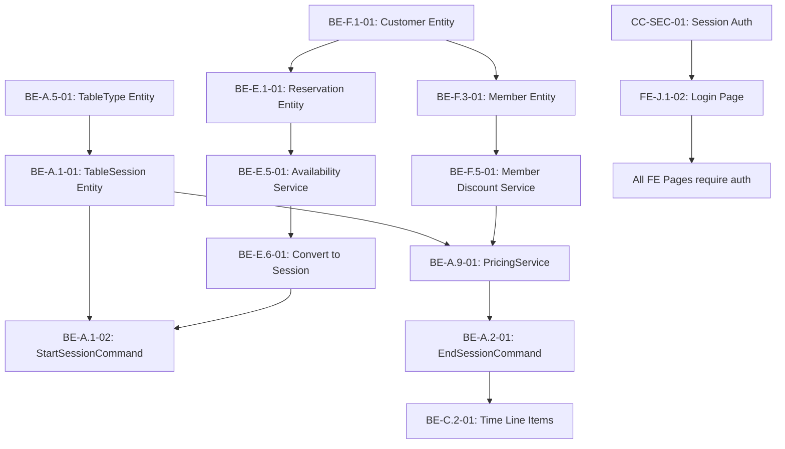

# SSI-INFORBILLIAR Delivery Plan - Summary

> **Generated**: 2026-01-09  
> **Updated**: 2026-01-12 (Tax & Financial Rules Requirements Complete)  
> **Source**: Feature Audit dated 2026-01-08  
> **Total Features**: 164 across 13 categories

---

## Executive Overview

This delivery plan translates the SSI-INFORBILLIAR feature parity audit into **193 actionable development tickets** organized by priority, category, and layer (backend/frontend).

### Current State
- **Fully Implemented**: 37 features (29.4%)
- **Partially Implemented**: 44 features (34.9%)
- **Not Implemented**: 45 features (35.7%)

### Recent Completions (2026-01-13)
- ✅ **UI Polish & Optimization Specification**: Comprehensive requirements document with 15 detailed requirements covering Switchboard redesign, toast notifications, session timers, manager PIN dialogs, confirmation dialogs, enhanced table map, missing critical pages, dialog patterns, keyboard shortcuts, touch optimization, accessibility, visual consistency, error handling, and performance
- ✅ **UI Polish & Optimization Design**: Complete technical design with component architecture, visual mockups, data models, 12 correctness properties, error handling strategies, and comprehensive testing strategy
- ✅ **UI Polish & Optimization Tasks**: 26 detailed implementation tasks with property-based testing requirements covering core UI components, pages, dialogs, accessibility, and performance optimization
- ✅ **Table & Game Management Specification**: Comprehensive requirements document with 15 detailed requirements covering advanced pricing rules, session pause/resume, manager overrides, guest count management, table operations, and performance requirements
- 🎉 **MAJOR MILESTONE**: **Table & Game Management Core Implementation Complete** - Tasks 1-4 + all property tests implemented and passing. Enhanced Domain Layer, Advanced Pricing Service, Session Control Service, and Manager Override Service fully implemented with comprehensive property-based testing.
- 🔄 **NEW TASK IN PROGRESS**: Task 12 - Enhanced Presentation Layer Components implementation started (session ViewModels with pause/resume, manager override dialogs, equipment management interfaces, advanced pricing configuration, real-time monitoring dashboard, table operations interfaces)
- 🔄 **TASK IN PROGRESS**: Task 11 - Infrastructure Layer Extensions implementation started (repositories for equipment/game history/server assignments, enhanced caching, audit repositories, EF Core configurations, alert service integration, performance monitoring)
- 🔄 **TASK IN PROGRESS**: Task 10 - Enhanced Application Layer Commands implementation started (pause/resume commands, manager override commands, guest count updates, session transfers, table operations)
- ✅ **Table & Game Management Tasks**: Implementation plan refined with property-based testing requirements (Task 13.1 made required for real-time monitoring)
- ✅ **Tax & Financial Rules Specification**: Comprehensive requirements document with 12 detailed requirements covering multi-tax rates, exemptions, service charges, auto-gratuity, and multi-currency support
- ✅ **Technical Design**: Complete Clean Architecture design with domain entities, services, and integration patterns
- ✅ **Implementation Roadmap**: 17 detailed tasks with property-based testing strategy and acceptance criteria

### Critical Gaps (P0 Priority)
| Category | Gap Description |
|----------|-----------------|
| **A. Table & Game** | Core time-based billing - Session start/end/pause entirely missing |
| **E. Reservations** | Entire module missing (0/12 features) |
| **F. Customer/Member** | Entire module missing (0/13 features) |
| **J. Security** | No login page - critical security gap |

---

## Ticket Summary

| Layer | P0 | P1 | P2 | Total |
|-------|-----|-----|-----|-------|
| Backend | 25 | 35 | 60 | **120** |
| Frontend | 16 | 15 | 25 | **56** |
| UI Polish | 3 | 22 | 1 | **26** |
| Cross-Cutting | 8 | 8 | 1 | **17** |
| **Total** | **52** | **80** | **87** | **219** |

---

## Delivery Structure

```
SSI-INFORBILLIAR-Delivery-Plan/
├── 00-Delivery-Overview/
│   └── Delivery-Strategy.md         # Phased approach and priorities
├── 01-Feature-Index/
│   └── Feature-to-Ticket-Matrix.md  # Master feature-to-ticket mapping
├── 02-Backend-Tickets/
│   ├── A-Table-Game-Management/     # 20 tickets
│   ├── B-Floor-Layout-Management/   # 4 tickets
│   ├── C-Billing-Payments-Pricing/  # 11 tickets
│   ├── D-Tax-Currency-Financial/    # 3 tickets
│   ├── E-Reservations-Scheduling/   # 13 tickets
│   ├── F-Customer-Member-Management/# 13 tickets
│   ├── G-Inventory-Products/        # 7 tickets
│   ├── H-Reporting-Export/          # 13 tickets (10 original + 3 infrastructure)
│   ├── I-Hardware-Peripherals/      # 5 tickets
│   └── J-M-Combined/                # 11 tickets
├── 03-Frontend-Tickets/
│   ├── A-Table-Game-Management/     # 10 tickets
│   ├── E-Reservations-Scheduling/   # 7 tickets
│   ├── F-Customer-Member-Management/# 8 tickets
│   └── Consolidated-B-D-G-M/        # 21 tickets
├── 04-Cross-Cutting/
│   └── Cross-Cutting-Tickets.md     # 17 infrastructure tickets
├── 05-Progress-Tracking/
│   ├── Ticket-Status.md             # Machine-updatable status tracker
│   └── Feature-Completion.md        # Feature-level progress
└── 99-Governance/
    ├── Guardrail-Compliance.md      # Quality gate mapping
    └── Definition-of-Done.md        # Completion criteria
```

---

## Recommended Phase Sequence

### Phase 1: Foundation (Weeks 1-4) — P0 Backend
- Database migrations for new entities
- TableSession & TableType entities
- Reservation entity
- Customer & Member entities
- PricingService implementation
- Session authentication service

**Tickets**: 25 backend P0 + 8 cross-cutting P0 = **33 tickets**

### Phase 2: Core UI (Weeks 5-8) — P0 Frontend + UI Polish
- Login page (security critical)
- Session dialogs (start/end/pause)
- Reservation calendar
- Customer management pages
- Manager PIN dialog
- Core UI components (toast notifications, loading overlays)

**Tickets**: 16 frontend P0 + 3 UI polish P0 = **19 tickets**

### Phase 3: Competitive Parity (Weeks 9-12) — P1
- First-hour and rounding pricing rules
- Member discounts integration
- Reporting dashboards
- Split payment improvements
- Stock tracking
- UI polish and optimization (Switchboard redesign, enhanced table map, touch optimization, accessibility)

**Tickets**: 30 backend P1 + 14 frontend P1 + 22 UI polish P1 + 8 CC P1 = **74 tickets**

### Phase 4: Differentiation (Weeks 13-17) — P2
- Recurring reservations
- Advanced analytics
- Hardware integrations
- Export capabilities
- Polish features
- UI polish final touches (audit log page, visual consistency testing)

**Tickets**: 28 backend P2 + 10 frontend P2 + 1 UI polish P2 + 1 CC P2 = **40 tickets**

---

## Resource Recommendations

| Role | FTE | Focus |
|------|-----|-------|
| Backend Developer | 2 | Domain entities, commands, queries |
| Frontend Developer | 1.5 | WinUI 3 pages, dialogs, controls |
| QA Engineer | 1 | Test automation, manual verification |
| DevOps | 0.5 | CI/CD, migrations, deployment |

---

## Quality Gates

All tickets must pass:
1. **Code Review**: Peer review against guardrails
2. **Test Coverage**: Domain ≥90%, App ≥80%, Infra ≥70%
3. **No Silent Failures**: All errors visible to operators
4. **MVVM Compliance**: No business logic in ViewModels
5. **Definition of Done**: All acceptance criteria met

---

## Key Dependencies


```mermaid
graph TD
    A[BE-A.5-01: TableType Entity] --> B[BE-A.1-01: TableSession Entity]
    B --> C[BE-A.9-01: PricingService]
    B --> D[BE-A.1-02: StartSessionCommand]
    C --> E[BE-A.2-01: EndSessionCommand]
    E --> F[BE-C.2-01: Time Line Items]
    
    G[BE-F.1-01: Customer Entity] --> H[BE-F.3-01: Member Entity]
    H --> I[BE-F.5-01: Member Discount Service]
    I --> C
    
    G --> J[BE-E.1-01: Reservation Entity]
    J --> K[BE-E.5-01: Availability Service]
    K --> L[BE-E.6-01: Convert to Session]
    L --> D
    
    M[CC-SEC-01: Session Auth] --> N[FE-J.1-02: Login Page]
    N --> O[All FE Pages require auth]
```

---

## Risk Mitigation

| Risk | Mitigation |
|------|------------|
| Scope creep | Strict P0 focus for MVP |
| Integration complexity | Start with database migrations |
| Testing gaps | Mandate coverage thresholds |
| Schedule slip | Weekly progress reviews |

---

## Next Steps

1. **Review this plan** and prioritize any adjustments
2. **Set up sprint calendar** with team capacity
3. **Begin Phase 1** with database migrations
4. **Track progress** in `05-Progress-Tracking/` files

---

*This plan is a living document. Update progress tracking files as work proceeds.*
