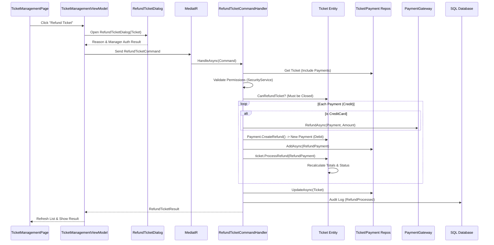

# Technical Deep Dive: Ticket Refund Process

## Overview
This document details the end-to-end technical flow of the Ticket Refund process in Magidesk, covering the User Interface, Backend Logic, Domain Rules, and Database interactions.

## 1. High-Level Flow
1.  **User Action**: User initiates refund from `TicketManagementPage`.
2.  **UI Interaction**: `RefundTicketDialog` captures reason and manager authorization.
3.  **Command Dispatch**: `RefundTicketCommand` is sent to the Application layer.
4.  **Backend Processing**: `RefundTicketCommandHandler` validates, processes refunds via gateway (if applicable), and updates domain entities.
5.  **Persistence**: New "Debit" payment records are saved, and the Ticket status is updated.

---

## 2. Component Interaction Diagram



---

## 3. UI Layer Detail

### Trigger Point
- **Location**: `TicketManagementPage.xaml`
- **Control**: "Refund Ticket" Button
- **Binding**: `RefundSelectedCommand` in `TicketManagementViewModel`

### View Model Logic (`TicketManagementViewModel.cs`)
- **Validation**: Ensures a ticket is selected.
- **Dialog**: Instantiates `RefundTicketDialog`.
- **Authorization**: The dialog logic handles the `ManagerPinDialog` flow to ensure the user has the required authorization PIN.
- **Execution**: Constructs `RefundTicketCommand` with:
    - `TicketId`: selected ticket GUID.
    - `ProcessedBy`: ID of the authorizing manager.
    - `Reason`: Text input from dialog.
    - `TerminalId`: Current terminal identifier.

---

## 4. Application Layer Detail

### Command Handler (`RefundTicketCommandHandler.cs`)

#### 1. Security Check
- Uses `ISecurityService` to verify the `ProcessedBy` user has `UserPermission.RefundTicket`.

#### 2. Validation
- **Existence**: Checks if Ticket exists in DB.
- **Domain Rule**: Calls `TicketDomainService.CanRefundTicket(ticket)`.
    - Ticket must be in `Closed` status.
    - Must have existing valid payments.

#### 3. Payment Processing Loop
The handler iterates through all **valid, non-voided Credit payments** associated with the ticket.

- **Gateway Integration**:
    - If the payment is `CreditCardPayment`, it calls `_paymentGateway.RefundAsync()`.
    - **Failure Handling**: If the gateway fails, it logs an **Audit Event** (Failure) but *continues* to process other payments if possible (soft failure). The specific payment is skipped for internal refund creation.

- **Entity Creation**:
    - Calls `Payment.CreateRefund(originalPayment, ...)` factory method.
    - This creates a **new** `Payment` entity that is a clone of the original but with:
        - `TransactionType` = `Debit` (The defining characteristic of a refund).
        - `Amount` = `Original Amount` (Full refund logic).
        - `Relation`: Linked to the same `TicketId`.

#### 4. Domain Logic Application
- Calls `ticket.ProcessRefund(refundPayment)`.
    - Adds the new debit payment to the ticket's collection.
    - **Recalculates Paid Amount**: `PaidAmount = Sum(Credits) - Sum(Debits)`.
    - **Recalculates Due Amount**: `DueAmount` increases back to the original total (effectively unpaid).
    - **Status Update**: If `PaidAmount` becomes <= 0, `ticket.Status` updates to `TicketStatus.Refunded`.

---

## 5. Database Changes

### Tables Affected

1.  **`Payments` Table**:
    - **INSERT**: A new row is inserted for every refunded payment.
    - **Columns**:
        - `Id`: New GUID.
        - `TicketId`: Same as original.
        - `TransactionType`: `Debit` (Enum value).
        - `Amount`: Refund amount.
        - `ProcessedBy`: Manager User ID.
        - `Note`: "Refund of payment {Id}. Reason: {Reason}".

2.  **`Tickets` Table**:
    - **UPDATE**: The existing ticket row is updated.
    - **Columns**:
        - `Status`: Changed to `Refunded` (Enum value) [If full refund].
        - `PaidAmount`: Reduced (likely to 0).
        - `DueAmount`: Increased (likely to TotalAmount).
        - `Version`: Incremented (Optimistic Concurrency).

3.  **`AuditEvents` Table**:
    - **INSERT**: Multiple rows.
        - One event per payment refunded (`RefundProcessed`).
        - One event for the overall Ticket refund operation.
    - Contains JSON data snapshot of the action.

## 6. Failure Modes

| Failure Point | System Behavior | Data State |
| :--- | :--- | :--- |
| **Manager Auth Fails** | UI blocks request. | No DB changes. |
| **Gateway Offline** | Handler logs failure audit. | Gateway audit log entry created. DB state remains unchanged for that payment. |
| **Concurrency (Optimistic)** | `DbUpdateConcurrencyException`. | Transaction rolls back. User asked to retry. |
| **Partial Refund** | *Current logic processes all payments.* | If one payment fails gateway but others succeed, ticket remains partially paid/refunded. Logic allows continuation. |

## 7. Key Code References

- **Command**: `Magidesk.Application.Commands.RefundTicketCommand`
- **Handler**: `Magidesk.Application.Services.RefundTicketCommandHandler`
- **Domain Entity**: `Magidesk.Domain.Entities.Ticket` (Method `ProcessRefund`)
- **Factory**: `Magidesk.Domain.Entities.Payment` (Method `CreateRefund`)

---

## 8. Database Transaction & State Visuals

The following diagram illustrates the state transformation of entities during a successful refund.

```mermaid
graph TD
    subgraph Ticket[Ticket Entity Changes]
        direction TB
        T1[State: Paid] -->|Refund Action| T2[State: Refunded]
        T3[PaidAmount: $50.00] -->|Reset| T4[PaidAmount: $0.00]
        T5[DueAmount: $0.00] -->|Reset| T6[DueAmount: $50.00]
        style T2 fill:#f96,stroke:#333
        style T4 fill:#f96,stroke:#333
        style T6 fill:#f96,stroke:#333
    end

    subgraph Payments[Payment Records]
        direction TB
        P1[Payment 1: Credit $50 (Cash)]
        PNew[New Payment: Debit $50 (Cash)]
        P1 -->|TicketId| TicketEntity[Ticket Agg]
        PNew -->|TicketId| TicketEntity
        style PNew fill:#9f9,stroke:#333
        note[Note: 'Refund of payment {Id}...' ] -.-> PNew
    end

    subgraph Audit[Audit Logs]
        A1[Event: RefundProcessed (Payment)]
        A2[Event: RefundProcessed (Ticket)]
        A1 --> A2
        style A1 fill:#ccf,stroke:#333
        style A2 fill:#ccf,stroke:#333
    end

    Ticket --> Payments
    Payments --> Audit
```

