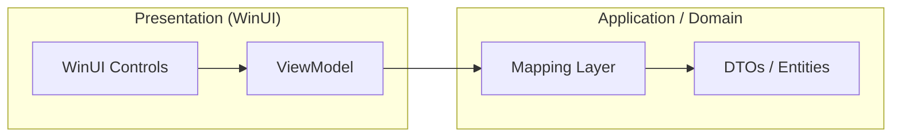

# Type Mapping Rules (UI <-> VM <-> Domain)

Any data crossing the boundary between WinUI (Presentation) and the Core (Domain/Application) must pass through a strict mapping layer to ensure no platform-specific types corrupt the domain logic and no invalid states are persisted.

## 1. Mapping Boundary

## 2. Coordinate Conversion (Int-to-Double)

| Layer | Type | Rule |
|-------|------|------|
| **Domain** | `double` | The source of truth (Upgraded for precision). |
| **ViewModel** | `double` | Native representation for UI and smooth dragging. |
| **Mapping (In/Out)** | `Identity` | Pass-through `double` values to preserve precision. |

## 3. Enum Safety

- **WinRT Enums**: Surface-level UI enums (if any) must be explicitly mapped to `Magidesk.Domain.Enumerations`.
- **Invalid Mappings**: If a mapping fails (e.g., unexpected integer from DB), the Mapping layer MUST:
    1. Log the error.
    2. Map to a safe `Default` (e.g., `ShapeType.Rectangle`).
    3. Block the "Save" operation to prevent cascading corruption.

## 4. UI-to-Domain Flow

1. **User Action**: Drags table.
2. **ViewModel**: Updates `X` (double) for smooth UI rendering.
3. **Commit**: Command is built. `X` is passed as `double`.
4. **Validation**: Business rules check for bounds (0 to Floor.Width).
5. **Persistence**: `Table` entity is updated.

## 5. Failure Protocol

Any crash during mapping is UNACCEPTABLE.
- **Catch block**: All mapping operations must be wrapped in `try/catch`.
- **User Notification**: Failed mappings must show a non-fatal Dialog explaining "Data Format Incompatibility" and preventing save.
